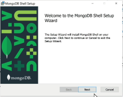
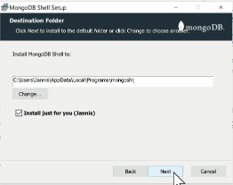
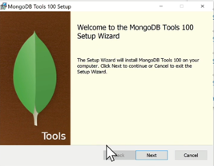
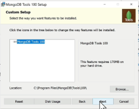
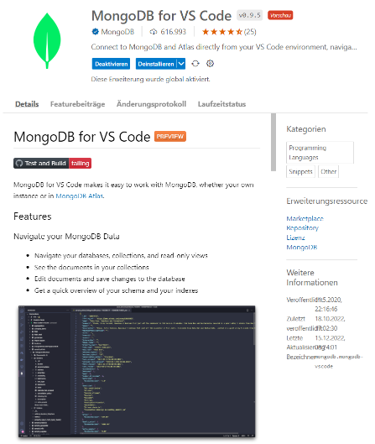

|               |                                 |                                        |
| ------------- | ------------------------------- | -------------------------------------- |
| **Modul 165** | **NoSQL-Datenbanken einsetzen** |  |

- [1. Voraussetzungen / Softwareinstallationen](#1-voraussetzungen--softwareinstallationen)
  - [1.1. MongoDB](#11-mongodb)
    - [1.1.1. Downloads](#111-downloads)
    - [1.1.2. Installation Server](#112-installation-server)
    - [1.1.3. Installation Shell u. Tools](#113-installation-shell-u-tools)
    - [1.1.4. MongoDB for VS-Code](#114-mongodb-for-vs-code)
  - [2. Mongo-Shell (mongosh) Commands](#2-mongo-shell-mongosh-commands)
- [3. Aufgabe - Installation u. Softwarevoraussetzungen / Tools](#3-aufgabe---installation-u-softwarevoraussetzungen--tools)

 

# 1. Voraussetzungen / Softwareinstallationen

## 1.1. MongoDB

### 1.1.1. Downloads

- [Download Community Edition](https://www.mongodb.com/try/download/community)
- [MongoDB Shell](https://www.mongodb.com/try/download/shell)
- [Database Tools (msi Package)](https://www.mongodb.com/try/download/database-tools)

### 1.1.2. Installation Server

- MongoDB Community Server Download
- Vollständige Installation
- Inkl. Compass

### 1.1.3. Installation Shell u. Tools

- Mongo Shell
  - 
  - 

- MongoDB Tools
  - 
  - 

### 1.1.4. MongoDB for VS-Code

- 

 

---

## 2. Mongo-Shell (mongosh) Commands

- Die MongoDB-Shell ist der schnellste Weg zum Verbinden, Konfigurieren, Abfragen und Arbeiten mit Ihrer MongoDB-Datenbank.
- Die Shell fungiert als Befehlszeilen-Client des MongoDB-Servers.

- Shell starten
  - `C:\>mongosh\mongosh.exe`
- Datenbanken anzeigen
  - `test>show dbs`
- Shell beenden
  - `test> exit`

---

 

# 3. Aufgabe - Installation u. Softwarevoraussetzungen / Tools

| **Vorgabe**             | **Beschreibung**                     |
| ----------------------- | ------------------------------------ |
| **Lernziele**           | Softwarevoraussetzungen sind erfüllt |
| **Sozialform**          | Einzelarbeit                         |
| **Auftrag**             | Softwareinstallationen auf Laptop    |
| **Hilfsmittel**         | siehe Download links                 |
| **Erwartete Resultate** |                                      |
| **Zeitbedarf**          | 40 min                               |
| **Lösungselmente**      | Ausführbare SW Anwendungen           |

Installiere alle erforderlichen Softwarekomponenten auf Deinem Rechner.
Teste soweit möglich, dass alle Komponenten ohne Fehler ausgeführt werden und funktionstauglich sind.
