|               |                                 |                                        |
| ------------- | ------------------------------- | -------------------------------------- |
| **Modul 165** | **NoSQL-Datenbanken einsetzen** |  |

- [1. MongoDB Modeling](#1-mongodb-modeling)
  - [1.1. Einleitung](#11-einleitung)
  - [1.2. Step by Step interation](#12-step-by-step-interation)
  - [1.3. Embedded Documents (Eingebettete Dokumente)](#13-embedded-documents-eingebettete-dokumente)
  - [1.4. Referenced Documents (Referenzierte Dokumente)](#14-referenced-documents-referenzierte-dokumente)
  - [1.5. Entscheidungsfaktoren (Embedded vs Referenced)](#15-entscheidungsfaktoren-embedded-vs-referenced)
  - [1.6. Beispiele](#16-beispiele)
    - [1.6.1. Datenmodell Embedding and linking](#161-datenmodell-embedding-and-linking)
    - [1.6.2. Datenmodell Embedding vs. Referencing / linking](#162-datenmodell-embedding-vs-referencing--linking)
  - [1.7. Praxisbeispiel: Blogging-Plattform](#17-praxisbeispiel-blogging-plattform)
  - [1.8. Zusammenfassung](#18-zusammenfassung)
- [2. Aufgaben](#2-aufgaben)
  - [2.1. Aufgabe Album SQL-Migration](#21-aufgabe-album-sql-migration)
  - [2.2. Aufgabe Blog-Model implementieren](#22-aufgabe-blog-model-implementieren)
  - [2.3. Aufgabe CarUser Datenbank implementieren](#23-aufgabe-caruser-datenbank-implementieren)
  - [2.4. Aufgabe Abo-Verwaltung implementieren](#24-aufgabe-abo-verwaltung-implementieren)

---

</br>

# 1. MongoDB Modeling

## 1.1. Einleitung

- Datenmodellierung in MongoDB unterscheidet sich grundlegend von relationalen Datenbanken, da MongoDB schemalos ist und eine flexible Dokumentenstruktur verwendet.
- Das Design eines effizienten Datenmodells erfordert die Berücksichtigung der Anwendungsanforderungen und der Abfrage- sowie Speicherstrategien.
- Die grösste Herausforderung bei der Datenmodellierung besteht darin, die Anforderungen der Anwendung, die Leistungsmerkmale der Datenbankmaschine und die Datenabrufmuster in Einklang zu bringen.
- Im Gegensatz zu SQL-Datenbanken, bei denen das Schema einer Tabelle vor dem Einfügen von Daten festgelegt und deklariert werden muss, ist es bei MongoDB standardmässig nicht erforderlich, dass die Dokumente das gleiche Schema haben.
- Die Dokumente in einer einzelnen Sammlung müssen nicht denselben Satz von Feldern haben und der Datentyp für ein Feld kann sich zwischen den Dokumenten innerhalb einer Sammlung unterscheiden.
- 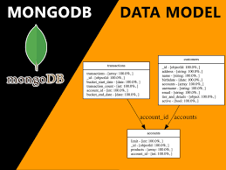

|                                                        |                                                                                          |
| ------------------------------------------------------ | ---------------------------------------------------------------------------------------- |
|          | **Data that is accessed together gets stored together!**                                 |
|  | **Making your application faster </br> Saving Money </br> Make developers lives easier** |

## 1.2. Step by Step interation

- Möchte ich hauptsächlich die eingebetteten Informationen?
- Muss ich mit den eingebetteten Daten suchen?
- Wie häufig werden sich die eingebetteten Daten ändern?
- Brauche ich die neueste Version oder die gleiche Version?
- Werden die eingebetteten Daten gemeinsam genutzt oder sind sie privat - doppelt prüfen?

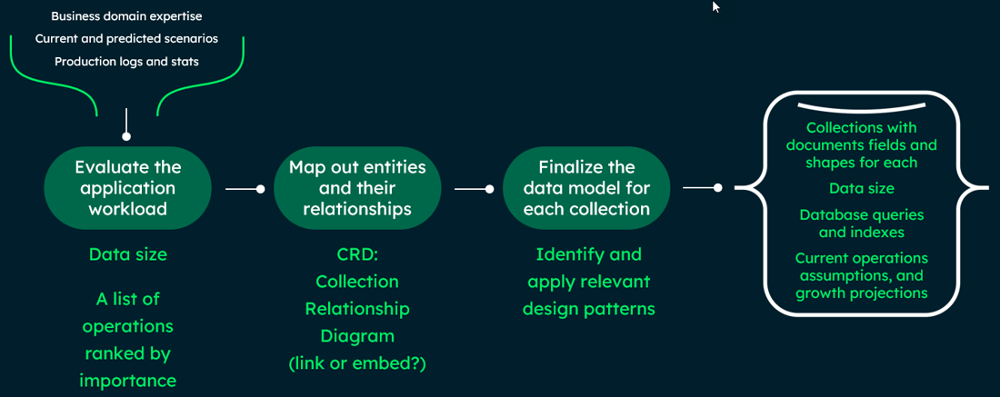

## 1.3. Embedded Documents (Eingebettete Dokumente)

Daten, die logisch miteinander verbunden sind, werden in einem Dokument gespeichert.

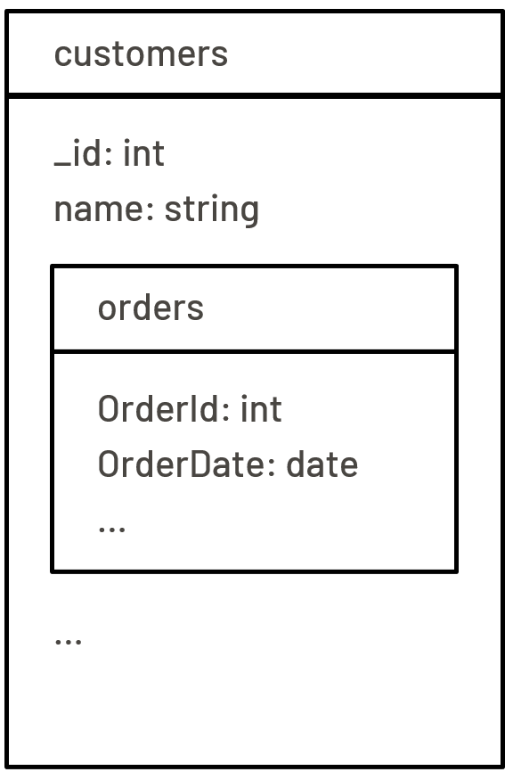

**Vorteile:**

- Reduzierte Anzahl von Joins.
- Schnellere Leseoperationen.
- Geeignet für Daten mit 1:n-Beziehungen.
- Sie können alle relevanten Informationen in einer einzigen Abfrage abrufen.
- Vermeiden Sie die Implementierung von Joins im Anwendungscode oder die Verwendung von $lookup.
- Aktualisieren Sie zusammenhängende Informationen in einem einzigen atomaren Vorgang. Standardmässig sind alle CRUD-Operationen für ein einzelnes Dokument ACID-konform.
  - Sie müssen die Informationen nur an einer Stelle ändern.
- Diese denormalisierten Datenmodelle ermöglichen es Anwendungen, zusammenhängende Daten in einer einzigen Datenbankoperation abzurufen und zu bearbeiten.
- Für viele Anwendungsfälle in MongoDB ist das denormalisierte Datenmodell optimal.

**Nachteile:**

- Grosse Dokumente bedeuten mehr Overhead, wenn die meisten Felder nicht relevant sind.
- Sie können die Abfrageleistung erhöhen, indem Sie die Grösse der Dokumente begrenzen, die Sie für jede Abfrage über die Leitung senden.
- Sie können auch die Komprimierung über die Leitung aktivieren.
- Embedded führt zur Redundanzen (doppelte Daten), ggf. zu grösseren Dokumenten (z.B. Lokation)
- In MongoDB ist die Dokumentgröße auf **16 MB** begrenzt.

Beispiel

```javascript
{
  "_id": 1,
  "name": "Max Mustermann",
  "adresse": {
    "straße": "Musterstraße 1",
    "stadt": "Berlin",
    "plz": "10115"
  }
}
```

Beispiel

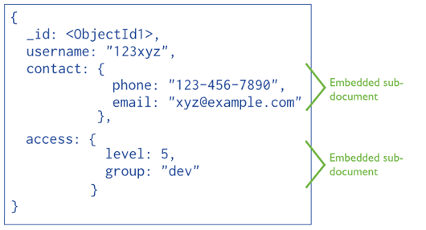

## 1.4. Referenced Documents (Referenzierte Dokumente)

Daten werden auf mehrere Dokumente verteilt und durch Referenzen verknüpft.

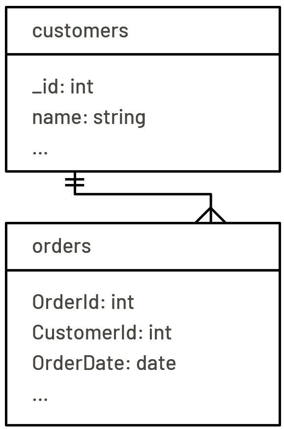

**Vorteile:**

- Bessere Datenkonsistenz.
- Reduzierung von Redundanz bei häufig wiederkehrenden Daten.
- Geeignet für Daten mit m:n-Beziehungen.
- Kleinere Dokumente (typischerweise).
- Es ist weniger wahrscheinlich, dass die 16-MB-Grenze pro Dokument erreicht wird.
- Informationen, auf die nur selten zugegriffen wird, werden nicht bei jeder Abfrage benötigt.
- Verringern Sie die Duplizierung von Daten.
- Es ist wichtig zu beachten, dass die Datenduplizierung nicht vermieden werden sollte, wenn sie zu einem besseren Schema für Ihre Anwendung führt.
- Speicher ist billig.
- Referenzen speichern die Beziehungen zwischen Daten, indem sie Links oder Verweise von einem Dokument zum anderen enthalten.
- Anwendungen können diese Verweise auflösen, um auf die entsprechenden Daten zuzugreifen.
- Im Allgemeinen handelt es sich um normalisierte Datenmodelle.
- Daten können gemeinsam genutzt werden ohne Duplikate (z.B. Location).
- Referenzen führt zu einer besseren Datenintegrität.
- Geringeren Speicherbedarf

**Nachteile:**

- Um alle Daten in den referenzierten Dokumenten abrufen zu können, sind mindestens zwei Abfragen oder `$lookup` erforderlich, um alle Informationen abzurufen.
- Die Änderung einer Dateneinheit führt in der Regel dazu, dass viele Dokumente aktualisiert werden.

**Beispiel:**

```javascript
{
  "_id": 1,
  "name": "Max Mustermann",
  "adresseId": 101
}

{
  "_id": 101,
  "straße": "Musterstraße 1",
  "stadt": "Berlin",
  "plz": "10115"
}
```

Beispiel

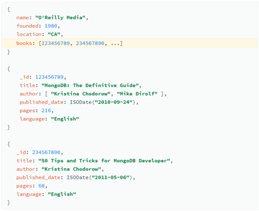

---

## 1.5. Entscheidungsfaktoren (Embedded vs Referenced)

| **Kriterium**                  | **Embedded**                    | **Referenced**                     |
| :----------------------------- | :------------------------------ | :--------------------------------- |
| Datenbeziehung                 | 1:n oder n:1                    | n:m oder sehr komplexe Beziehungen |
| Häufigkeit der Datenzugriffe   | Häufig zusammen abgefragt       | Unterschiedliche Zugriffsmuster    |
| Datenmenge                     | Klein bis mittelgross           | Sehr grosse Datenmengen            |
| Flexibilität der Datenstruktur | Weniger Änderungen erforderlich | Häufige Strukturänderungen         |

| **Beziehung**             | **Art**                                                      | **Referenced**                                          |
| :------------------------ | :----------------------------------------------------------- | :------------------------------------------------------ |
| One-to-One                | Bevorzugt Schlüssel-Wert-Paare </br> innerhalb des Dokuments | 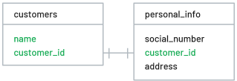     |
| One-to-Few                | Einbettung bevorzugen                                        |                                                         |
| One-to-Many               | Einbettung bevorzugen                                        | 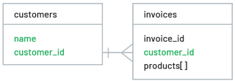   |
| One-to-Thousands/millions | Referenzierung bevorzugen                                    | 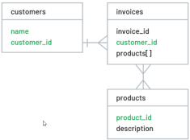 |
| Many-to-Many              | Referenzierung bevorzugen                                    |                                                         |

---

## 1.6. Beispiele

### 1.6.1. Datenmodell Embedding and linking

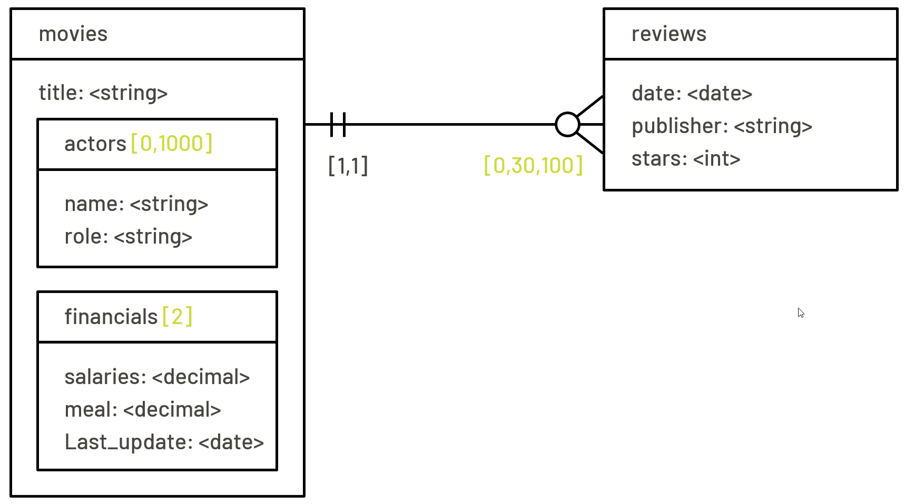

### 1.6.2. Datenmodell Embedding vs. Referencing / linking

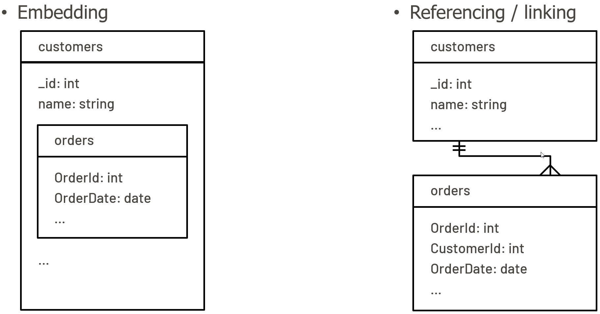

## 1.7. Praxisbeispiel: Blogging-Plattform

 Kommentare in Posts (Embedded Documents)

```javascript
{
  "_id": 1,
  "titel": "MongoDB Grundlagen",
  "inhalt": "Einführung in MongoDB.",
  "kommentare": [
    { "autor": "Anna", "text": "Sehr hilfreich!" },
    { "autor": "Peter", "text": "Toller Artikel." }
  ]
}
```

Benutzer und Posts (Referenced Documents)

```javascript
{
  "_id": 1,
  "name": "Max Mustermann",
  "email": "max@example.com"
}

{
  "_id": 101,
  "titel": "MongoDB Grundlagen",
  "autorId": 1
}
```

---

## 1.8. Zusammenfassung

Datenmodellierung in MongoDB bietet durch Flexibilität und Anpassungsfähigkeit große Vorteile für moderne Anwendungen.
Eine sorgfältige Planung und die Auswahl des passenden Modells (embedded oder referenced) sind entscheidend für die Effizienz und Skalierbarkeit der Datenbank.

---

</br>

# 2. Aufgaben

## 2.1. Aufgabe Album SQL-Migration

| **Vorgabe**             | **Beschreibung**                                                                                |
| :---------------------- | :---------------------------------------------------------------------------------------------- |
| **Lernziele**           | Können ein Datenmodell implementieren                                                           |
|                         | Kennen die Möglichkeiten der Aggregationsoperatoren                                             |
|                         | Können eine Datenabfrage basierend auf einer Aggregationspipeline mit mehreren Stages umsetzen. |
| **Sozialform**          | Einzelarbeit                                                                                    |
| **Auftrag**             | siehe unten                                                                                     |
| **Hilfsmittel**         | [Modeling](https://www.mongodb.com/docs/manual/data-modeling/)                                  |
|                         | [Query](https://www.mongodb.com/docs/v3.4/reference/operator/aggregation/lookup/)               |
| **Erwartete Resultate** |                                                                                                 |
| **Zeitbedarf**          | 50 min                                                                                          |
| **Lösungselmente**      | Vollständige Skriptdatei mit sämtlichen Lösungsdateien                                          |
|                         | Kurzpräsentation der Lösung                                                                     |

**Ausgangssituation:**
Die SQL-Beispiele gehen von zwei Tabellen aus, `album` und songs, die durch die Spalten song.album_id und songs.id verbunden sind.

**So sehen die Tabellen aus:**

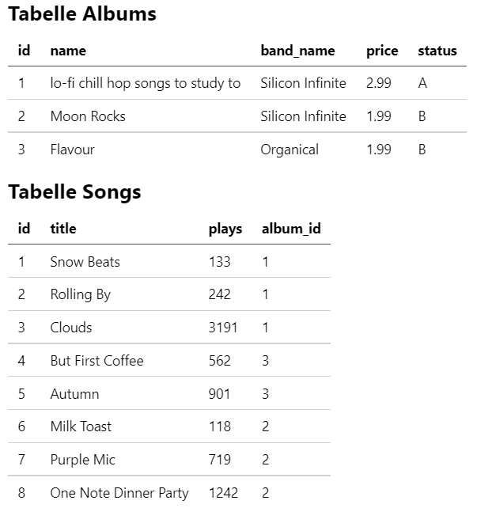

**Aufgabe 1:**
Erstelle das Schema zu diesen beiden Tabellen in einer relationalen Datenbank per SQL-Befehlen und füge die Daten in die Datenbanktabellen ein.

- **Lösungselemente:**
  - SQL-Create-Table Script-Datei
  - SQL-Insert-Data Script-Datei

**Aufgabe 2:**
Führe eine MongoDB Migration durch. Verwende dabei eine **Embedded** Datenstruktur.

- **Lösungselemente:**
  - MongoDB Insert-Skript-Datei

Indexiere min. 2 Nichtschlüssel-Elemente (z.B. name, band_name), sodass die Suchabfragen beschleunigt werden.

- **Lösungselemente:**
  - MongoDB Create-Index-Skript-Datei

**Aufgabe 4:**
Schreibe zu folgenden Datenabfragen die jeweiligen SQL- und MongoDB Befehle.

1. Ermittle die Anzahl Album Einträge
2. Ermittle die Preissumme aller Alben
3. Ermittle die Preissumme der Alben pro Band (`band_name`)
4. Ermittle die Preissumme der Alben pro Band (`band_name`), sortiert nach Preissumme aufsteigend
5. Ermittle die Anzahl Alben pro Band (`band_name`)
6. Ermittle die Anzahl Alben pro Band (`band_name`) mit `Status = "A"`
7. Ermittle die Summe der Musikstücke (`plays`) pro Bandname.
8. Ermittle pro Album den Song mit den meisten Musikstücken (`plays`).

---

## 2.2. Aufgabe Blog-Model implementieren

| **Vorgabe**             | **Beschreibung**                                                                                |
| :---------------------- | :---------------------------------------------------------------------------------------------- |
| **Lernziele**           | Können ein dokumentorientiertes Datenmodel entwickeln und grafisch darstellen                   |
|                         | Können ein Datenmodell implementieren                                                           |
|                         | Kennen die Möglichkeiten der Aggregationsoperatoren                                             |
|                         | Können eine Datenabfrage basierend auf einer Aggregationspipeline mit mehreren Stages umsetzen. |
| **Sozialform**          | Einzelarbeit                                                                                    |
| **Auftrag**             | siehe unten                                                                                     |
| **Hilfsmittel**         | [Modeling](https://www.mongodb.com/docs/manual/data-modeling/)                                  |
|                         | [Query](https://www.mongodb.com/docs/v3.4/reference/operator/aggregation/lookup/)               |
| **Erwartete Resultate** |                                                                                                 |
| **Zeitbedarf**          | 50 min                                                                                          |
| **Lösungselmente**      | Vollständige Skriptdatei mit sämtlichen Lösungsdateien                                          |
|                         | Kurzpräsentation der Lösung                                                                     |

**Ausgangssituation:**
Sie erhalten von einem Kunden einen Auftrag für eine **Blog**-Datenbank ein Modell zu erstellen, welche die üblichen Daten eines Blogs verwaltet. Dabei müssen folgende Anforderungen berücksichtigt werden:

- In der Blog-Datenbank gibt es Benutzer (`users`).
- Ein Benutzer kann Posts (`posts`) erfassen (auch mehrere).
- Ein Benutzer kann Posts (auch mehrere) kommentieren (`comments`).

Ein Teammitglied hat bereits Vorarbeit geleistet und folgende Datenbasis festgelegt:

- users: `_id`, `name`, `age`, `email`
- posts: `_id`, `title`, `text`, `tags` (soll ein Array sein)
- comments: `_id`, `text`

**Aufgabe 1:**

Entwickle ein **Datenmodell**, welches die aufgeführte Datenbasis dokumentorientiert grafisch darstellt.
Erstelle ggf. mehrere verschiedene Versionen des Datenmodells.
Berücksichtige dabei auch die gelernten wichtigen Grundsätze einer dokumentbasierten Datenstruktur (**Embed or Reference, rule of thumb**):

- Data that is accessed together gets stored together!
- Wie oft werden die eingebetteten Informationen benötigt?
- Muss ich mit den eingebetteten Daten suchen?
- Wie häufig werden sich die eingebetteten Daten ändern?
- Wie gross kann ein Dokument werden (Redundanzen)?

- **Lösungselemente:**
  - Grafik zum Datenmodell als .png oder .pdf Datei (db-model.png)
  - Beispiel: 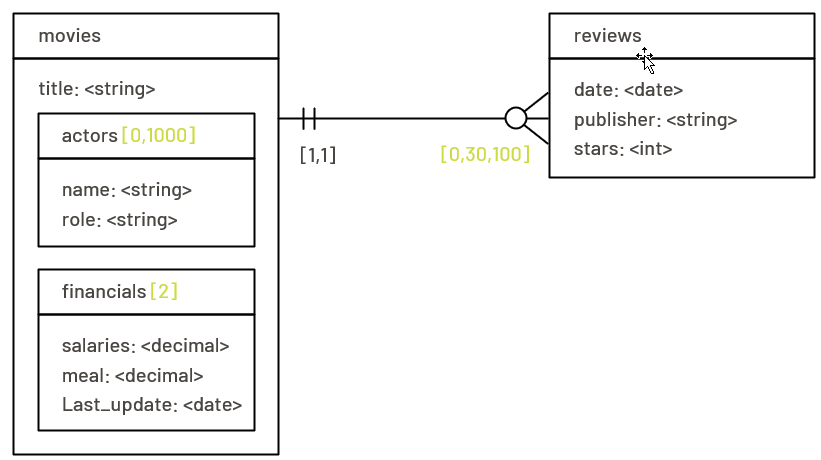

**Aufgabe 2:**
Schreibe die MongoDB-Befehle, die das Datenmodell in einer neuen Datenbank (Name = `blog`) zu implementieren. Füge min. 3 Dokumente je Kollektion ein.

- **Lösungselemente:**
  - MongoDB Skript-Befehle (create-model.mongodb.js).

**Aufgabe 3:**
Prüfe ob alle Daten korrekt in der Datenbank eingetragen mittels einfachen Suchbefehlen inkl. Suchen in Arrays.

- **Lösungselemente:**
  - MongoDB Skript-Befehle (simple-queries.mongodb.js)

**Aufgabe 4:**
Konsultiere die MongoDB Dokumentation und recherchiere Daten den `$lookup` Befehl um referenzierte Dokumente abzufragen (analog JOIN in SQL-Abfragen).
<https://www.mongodb.com/docs/v3.4/reference/operator/aggregation/lookup/>

- **Lösungselemente:**
  - MongoDB Skript-Befehle (aggregation-queries.mongodb.js)

---

## 2.3. Aufgabe CarUser Datenbank implementieren

| **Vorgabe**             | **Beschreibung**                                                                           |
| :---------------------- | :----------------------------------------------------------------------------------------- |
| **Lernziele**           | Sie sind in der Lage eine Datenbasis vollständig in der NoSQL Datenbank MongoDB einzufügen |
|                         | Sie können Datenbanken, Collection und Dokumente in die MongoDB erstellen und abfragen     |
| **Sozialform**          | Einzelarbeit                                                                               |
| **Auftrag**             | siehe unten                                                                                |
| **Hilfsmittel**         | [Modeling](https://www.mongodb.com/docs/manual/data-modeling/)                             |
| **Erwartete Resultate** |                                                                                            |
| **Zeitbedarf**          | 90 min                                                                                     |
| **Lösungselmente**      | Vollständige Skriptdatei mit sämtlichen Lösungsdateien                                     |
|                         | Kurzpräsentation der Lösung                                                                |

**Datenbasis:**

- 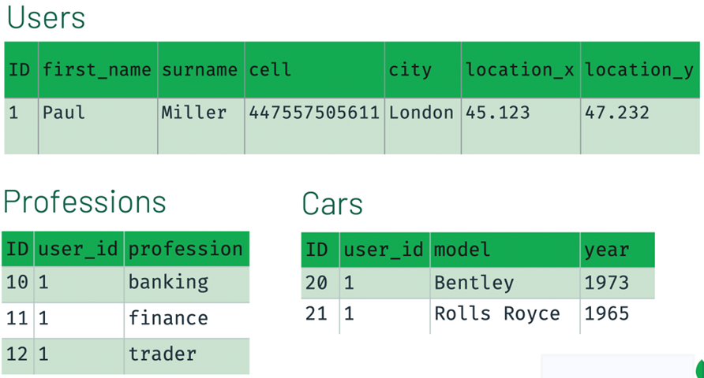

**Vorgehen:**

- Überlegen Sie sich, wie die **Dokumentstruktur** (JSON) aufgebaut werden soll.
- Erstelle eine neue Datenbank (`CarUsers`)
- Erstelle die Collections
- Füge die Daten als Dokumente der Collection hinzu.
- Kontrolliere die eingefügten Daten mit einer Suchabfrage

**Optional:**

- Überlege wie zur Verminderung von Redundanzen das Modell mit «Reference Documents» aufgebaut werden kann, sodass ein Auto auch mehreren Benutzern gehören kann.

---

## 2.4. Aufgabe Abo-Verwaltung implementieren

| **Vorgabe**             | **Beschreibung**                                                                           |
| :---------------------- | :----------------------------------------------------------------------------------------- |
| **Lernziele**           | Sie sind in der Lage eine Datenbasis vollständig in der NoSQL Datenbank MongoDB einzufügen |
|                         | Sie können Datenbanken, Collection und Dokumente in die MongoDB erstellen und abfragen     |
| **Sozialform**          | Einzelarbeit                                                                               |
| **Auftrag**             | siehe unten                                                                                |
| **Hilfsmittel**         | [Modeling](https://www.mongodb.com/docs/manual/data-modeling/)                             |
| **Erwartete Resultate** |                                                                                            |
| **Zeitbedarf**          | 90 min                                                                                     |
| **Lösungselmente**      | Vollständige Skriptdatei mit sämtlichen Lösungsdateien                                     |
|                         | Kurzpräsentation der Lösung                                                                |

**Datenbasis:**

| **Abo** | **Anrede** | **Name**   | **Vorname** | **Ort**     | **Eintritt** | **Aboart** | **Gebühr** |
| ------- | ---------- | ---------- | ----------- | ----------- | ------------ | ---------- | ---------- |
| 33      | Herr       | Balmelli   | Marco       | 8000 Zürich | 01.01.1990   | Student    | 500.00     |
| 44      | Frau       | Bürgin     | Sandra      | 8021 Zürich | 01.05.1989   | Jahresabo  | 1000.00    |
| 55      | Herr       | Emmenegger | Reto        | 8048 Zürich | 01.10.1994   | Monatsabo  | 150.00     |
| 66      | Herr       | Keller     | Georg       | 8021 Zürich | 30.11.1996   | Jahresabo  | 1000.00    |
| 77      | Frau       | Müller     | Karina      | 3000 Bern   | 30.08.2005   | Jahresabo  | 1000.00    |
| 88      | Herr       | Groz       | Thomas      | 4000 Basel  | 15.07.2005   | Student    | 500.00     |
| 99      | Frau       | Isabelle   | Pozzi       | 3000 Bern   | 15.07.2005   | Monatsabo  | 150.00     |

**Vorgehen:**

- Überlegen Sie sich, wie die **Dokumentstruktur** (JSON) aufgebaut werden soll.
- Erstelle eine neue Datenbank (`Abo`)
- Erstelle eine neue Collection (`Mitglieder`)
- Füge die Daten als Dokumente der Collection hinzu.
- Kontrolliere die eingefügten Daten mit einer Suchabfrage

**Optional:**

- Erstelle für eine performante Datenabfrage min. 2 Indexe
- Stelle einige Datenkonsistenz Bedingungen mittels eines Schemas (`$jsonSchema`) sicher
