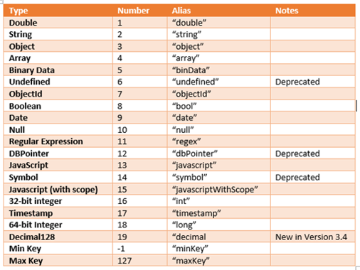
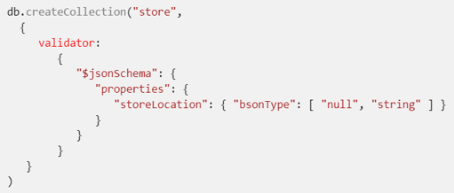
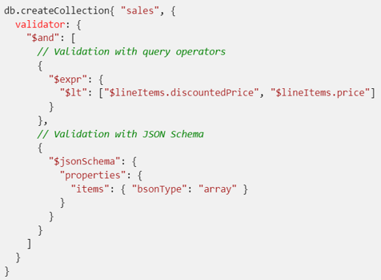
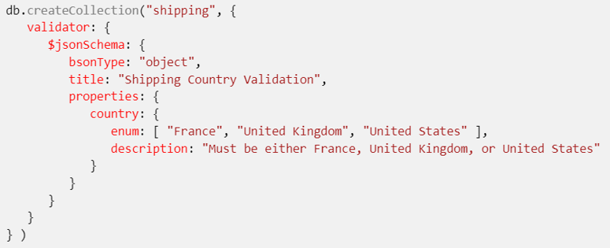
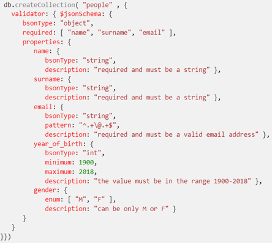

|               |                                 |                                        |
| ------------- | ------------------------------- | -------------------------------------- |
| **Modul 165** | **NoSQL-Datenbanken einsetzen** |  |

- [1. MongoDB Schema](#1-mongodb-schema)
  - [1.1. Einleitung](#11-einleitung)
  - [1.2. Sinn und Zweck der Schema-Validierung](#12-sinn-und-zweck-der-schema-validierung)
  - [1.3. Vorteile der Schema-Validierung](#13-vorteile-der-schema-validierung)
  - [1.4. Übersicht der Datentypen](#14-übersicht-der-datentypen)
  - [1.5. Beispiel Schema-Validierung](#15-beispiel-schema-validierung)
  - [1.6. Validierung hinzufügen](#16-validierung-hinzufügen)
  - [1.7. Optionen für die Schema-Validierung](#17-optionen-für-die-schema-validierung)
  - [1.8. Beispiele](#18-beispiele)
- [2. Aufgaben](#2-aufgaben)
  - [2.1. Aufgabe Blog Schema](#21-aufgabe-blog-schema)

---

</br>

# 1. MongoDB Schema

## 1.1. Einleitung

- MongoDB ist schemalos, bietet jedoch die Möglichkeit, eine Schema-Validierung zu implementieren.
- Diese Validierungen gewährleisten, dass die Daten einer Sammlung bestimmten Regeln entsprechen.
- Dadurch bleibt die Datenintegrität gewahrt, und Fehler durch unstrukturierte oder fehlerhafte Daten werden vermieden.
- Die Schema-Validierung in MongoDB kombiniert die Vorteile einer schemalosen Datenbank mit der Datenkonsistenz traditioneller Datenbanken.
- Sie ist besonders nützlich, um strukturelle Probleme zu vermeiden und robuste, fehlerfreie Anwendungen zu entwickeln.

## 1.2. Sinn und Zweck der Schema-Validierung

- Datenintegrität sicherstellen:
  - Stellt sicher, dass alle Dokumente in einer Sammlung die gleichen Schlüssel und Datentypen verwenden.
  - Vermeidet inkonsistente oder fehlerhafte Daten.
- Validierung auf Anwendungsebene minimieren:
  - Reduziert die Komplexität des Codes, da Validierungen direkt in der Datenbank erfolgen.
- Flexibilität bewahren:
  - MongoDB bleibt flexibel, da die Validierung optional ist und je nach Bedarf konfiguriert werden kann.
- Fehler und Anomalien verhindern:
  - Blockiert die Einfügung oder Aktualisierung von Dokumenten, die nicht den definierten Regeln entsprechen.

## 1.3. Vorteile der Schema-Validierung

- Strukturierte Daten: Garantiert konsistente Daten innerhalb der Sammlung.
- Weniger Fehler: Ungültige Daten werden frühzeitig erkannt.
- Flexibilität: Schema-Validierung kann je nach Projektanforderung angepasst oder deaktiviert werden.
- Sicherheitssteigerung: Verhindert böswillige oder unpassende Datenoperationen.

Regeln:

- bsonType: Datentyp
- required: Pflichtelemente
- properties: Datentypen, min, max, usw.

## 1.4. Übersicht der Datentypen



## 1.5. Beispiel Schema-Validierung

Erstelle eine Sammlung, in der alle Dokumente folgende Felder enthalten müssen:

- name: Ein String, der erforderlich ist.
- alter: Eine Zahl, die optional ist, aber größer oder gleich 0 sein muss.

```javascript
db.createCollection("benutzer", {
  validator: {
    $jsonSchema: {
      bsonType: "object",
      required: ["name"],
      properties: {
        name: {
          bsonType: "string",
          description: "Name muss ein String sein und ist erforderlich"
        },
        alter: {
          bsonType: "int",
          minimum: 0,
          description: "Alter muss eine positive Ganzzahl oder 0 sein"
        }
      }
    }
  }
})
```

```javascript
// Einfügen gültiges Dokument
db.benutzer.insertOne({ name: "Max Mustermann", alter: 30 })

// Einfügen ungültiges Dokument
// Fehler: Das Dokument verletzt die Schema-Validierung
db.benutzer.insertOne({ name: 123, alter: -5 })
```

## 1.6. Validierung hinzufügen

Schemavalidierungsregeln können mit dem `$jsonSchema`-Operator definiert werden.

Beispiel: Validierung nachträglich hinzufügen

```javascript
db.runCommand({
  collMod: "benutzer",
  validator: {
    $jsonSchema: {
      bsonType: "object",
      required: ["name"],
      properties: {
        name: {
          bsonType: "string",
          description: "Name muss ein String sein und ist erforderlich"
        },
        email: {
          bsonType: "string",
          pattern: "^[a-zA-Z0-9._%+-]+@[a-zA-Z0-9.-]+\\.[a-zA-Z]{2,}$",
          description: "Muss eine gültige E-Mail-Adresse sein"
        }
      }
    }
  }
})
```

## 1.7. Optionen für die Schema-Validierung

- `validationLevel`: Bestimmt, wie streng die Validierung angewendet wird.
- `strict`: Dokumente müssen das Schema vollständig erfüllen.
- `moderate`: Nur neue Dokumente oder geänderte Felder werden geprüft.
- `validationAction`: Legt fest, was passiert, wenn ein Dokument das Schema nicht erfüllt.
- `error`: Dokumente, die nicht dem Schema entsprechen, werden abgelehnt.
- `warn`: Dokumente werden eingefügt, aber eine Warnung wird ausgegeben.

```javascript
db.createCollection("produkte", {
  validator: {
    $jsonSchema: {
      bsonType: "object",
      required: ["name", "preis"],
      properties: {
        name: { bsonType: "string" },
        preis: { bsonType: "double", minimum: 0 }
      }
    }
  },
  validationLevel: "moderate",
  validationAction: "warn"
})
```

## 1.8. Beispiele

null Werte zulassen:
>

Bedingungen definieren (checks)

- lineItems.discountedPrice muss kleiner als lineItems.price sein.
- Das items Element muss ein Array sein.

>

Das enum Feld in country lässt nur Dokumente zu, deren country entweder "France", "United Kingdom", "United States" ist.
>

RegEx, Enum
>

---

</br>

---

# 2. Aufgaben

## 2.1. Aufgabe Blog Schema

| Vorgabe             | Beschreibung                                                                                          |
| ------------------- | ----------------------------------------------------------------------------------------------------- |
| Lernziele           | Mit Schema eine bestimmte Datenstruktur definieren und erzwingen ($jsonSchema)                        |
|                     | Validierungsregeln (Datentypen, Wertebereiche) festlegen und prüfen Existierende Dokumente validieren |
| Sozialform          | Einzelarbeit                                                                                          |
| Auftrag             | siehe unten                                                                                           |
| Hilfsmittel         | [Validation](https://www.mongodb.com/docs/manual/core/schema-validation/)                             |
| Erwartete Resultate |                                                                                                       |
| Zeitbedarf          | 90 min                                                                                                |
| Lösungselmente      | Vollständige Skriptdatei mit sämtlichen Lösungsdateien                                                |
|                     | Kurzpräsentation der Lösung                                                                           |

**Ausgangssituation:**

Die Blog Datenbank, die in vorangehender Aufgabe gelöst wurde, soll nun mit Schemas ergänzt werden. Die Schemas sollen eine feste Datenstruktur festlegen und mit Validierungsregeln eine bessere Datenqualität gewährleisten.

**Aufgabe 1:**

Implementiere für jede Kollektion ein Schema, welches alle Datenfelder Pflichtfeldern macht. Verwende dabei den `$jsonSchema` Operator und die beiden Befehle (`db.runCommand(), db.createCollection()`)
Folgende Elemente müssen im Schema definiert werden <https://www.mongodb.com/docs/manual/core/schema-validation/>

- Datentyp (bsonType)
- Pflichtelemente (required)
- Beschreibung (description)
- Lösungselemente:
  - MongoDB Skript-Befehle (`create-schema.mongodb.js`).

**Aufgabe 2:**

Prüfe die Schema-Definition indem korrekte und falsche Daten eingegeben werden. Versuche Fehler durch ungültigen Datentyp oder durch weglassen von Pflichtfeldern auszulösen.

- Lösungselemente:
  - MongoDB Skript-Befehle (`check-schema.mongodb.js`)

**Aufgabe 3:**

Erweitere das Schema, sodass Validierungsregeln wie **Muster (pattern), minimum/maximum und enum** zum Einsatz kommen.

- Lösungselemente:
  - MongoDB Skript-Befehle (`validationrules-schema.mongodb.js`)

**Aufgabe 4:**

Ändere ein Schema, sodass auch keine weiteren Felder einer Kollektion hinzugefügt werden können (`additionalProperties: false`)

- Lösungselemente:
  - MongoDB Skript-Befehle (`aggregation-queries.mongodb.js`)
