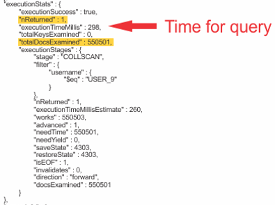
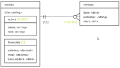

|               |                                 |                                        |
| ------------- | ------------------------------- | -------------------------------------- |
| **Modul 165** | **NoSQL-Datenbanken einsetzen** |  |

- [1. MongoDB Index](#1-mongodb-index)
  - [1.1. Einleitung](#11-einleitung)
  - [1.2. Sinn und Zweck von Indizes](#12-sinn-und-zweck-von-indizes)
  - [1.3. Arten von Indizes in MongoDB](#13-arten-von-indizes-in-mongodb)
    - [1.3.1. Einzelnes Feld (Single Field Index)](#131-einzelnes-feld-single-field-index)
    - [1.3.2. Zusammengesetzter Index (Compound Index)](#132-zusammengesetzter-index-compound-index)
    - [1.3.3. Text-Index](#133-text-index)
  - [1.4. Management von Indizes](#14-management-von-indizes)
  - [1.5. Best Practices für die Nutzung von Indizes](#15-best-practices-für-die-nutzung-von-indizes)
  - [1.6. Praxisbeispiele](#16-praxisbeispiele)
    - [1.6.1. Einfacher Index](#161-einfacher-index)
    - [1.6.2. Sortierung mit Index](#162-sortierung-mit-index)
    - [1.6.3. Compound Index](#163-compound-index)
- [2. Aufgaben](#2-aufgaben)
  - [2.1. Aufgabe Blog Index](#21-aufgabe-blog-index)
  - [2.2. Aufgabe Lernangebot](#22-aufgabe-lernangebot)

---

</br>

# 1. MongoDB Index

## 1.1. Einleitung

Indizes in MongoDB spielen eine zentrale Rolle bei der Optimierung von Abfragen. Sie **verbessern** die Performance von Leseoperationen erheblich, indem sie den Suchprozess beschleunigen. Ohne Indizes müsste MongoDB bei jeder Abfrage alle Dokumente in einer Sammlung durchsuchen (Full Collection Scan), was bei grossen Datenmengen ineffizient ist.

Indizes sind ein unverzichtbares Werkzeug zur Optimierung der Performance in MongoDB. Sie sollten sorgfältig geplant und verwaltet werden, um das richtige Gleichgewicht zwischen Lese- und Schreibgeschwindigkeit sowie Speicherverbrauch zu erreichen.
> Index müssen verwaltet werden, bei update, insert müssen diese nachgepflegt werden.

## 1.2. Sinn und Zweck von Indizes

- Verbesserte Abfragegeschwindigkeit
  - Ohne Index: MongoDB muss alle Dokumente durchsuchen, um passende Ergebnisse zu finden.
  - Mit Index: MongoDB greift direkt auf die relevanten Daten zu.
- Optimierung von Sortieroperationen
  - Indizes ermöglichen das schnelle Sortieren von Ergebnissen nach bestimmten Feldern.
- Unterstützung von Uniqueness
  - Unique-Indizes stellen sicher, dass Werte in einem Feld eindeutig sind.
- Skalierung und Performance
  - Indizes verbessern die Effizienz von Abfragen in grossen Datenmengen und verteilter Architektur (Sharding).

## 1.3. Arten von Indizes in MongoDB

### 1.3.1. Einzelnes Feld (Single Field Index)

- Ein Index wird auf ein einziges Feld angewendet.
- Beispiel: `db.users.createIndex({ "name": 1 })`
  - 1: Sortierung in aufsteigender Reihenfolge.
  - -1: Sortierung in absteigender Reihenfolge.

### 1.3.2. Zusammengesetzter Index (Compound Index)

- Ein Index wird auf mehrere Felder angewendet.
- Beispiel: `db.orders.createIndex({ "status": 1, "date": -1 })`
- Optimiert Abfragen, die sowohl status als auch date filtern.

Beispiel

```javascript
db.customer.createIndex({firstName: 1, lastName: 1})
```

- Reihenfolge der Eigenschaften ist wichtig.
- Alle Einträge werden zuerst nach firstName und dann nach lastName geführt.
- Bei einer Suche nach lastName kann dieser Index nicht verwendet werden.

### 1.3.3. Text-Index

- Wird verwendet, um Volltextsuche auf String-Feldern zu ermöglichen.
- `db.articles.createIndex({ "content": "text" })`
- Optimiert Textsuchen wie `db.articles.find({ $text: { $search: "MongoDB" } })`

## 1.4. Management von Indizes

```javascript
// Erstellen eines Index
db.collection.createIndex({ "field": 1 })

// Anzeigen vorhandener Indizes
db.collection.getIndexes()

// Entfernen eines Index
db.collection.dropIndex("indexName")

// Alle Indizes löschen
db.collection.dropIndexes()

//  Index-Statistiken anzeigen
db.collection.aggregate([{ $indexStats: {} }])
```

## 1.5. Best Practices für die Nutzung von Indizes

- Analyse der Abfragen
  - Verwenden Sie den `explain()`-Befehl, um Abfragen zu analysieren:
  - `db.collection.find({ "name": "Max" }).explain("executionStats")`
- Auswahl der richtigen Felder
  - Indizes sollten auf Feldern erstellt werden, die häufig für Filter- oder Sortieroperationen verwendet werden.
- Minimierung der Anzahl von Indizes
  - Zu viele Indizes können die Schreibgeschwindigkeit beeinträchtigen, da sie bei jedem Einfügen/Aktualisieren aktualisiert werden müssen.
- Verwendung von Compound Indizes
  - Verwenden Sie zusammengesetzte Indizes, um komplexe Abfragen zu optimieren.
- Überwachung der Indexgrösse
  - Indizes benötigen zusätzlichen Speicherplatz. Nutzen Sie `db.stats()` und `db.collection.stats()`, um die Speichergrösse zu überwachen.

Eine Suchabfrage kann mit der explain() Methode untersucht werden.
Dabei wird ein Ausführungsplan mit verschiedenen Parametern ausgegeben.

Wichtige Datenwerte zur Ausführung sind u.a.:

- executionTimeMillis
- totalDocsExamined
- Stage
- **COLLSCAN** liegt die gesamte Collection ein.
  - langsam



## 1.6. Praxisbeispiele

### 1.6.1. Einfacher Index

Finde alle Benutzer mit dem Namen "Anna":

```javascript
db.users.createIndex({ "name": 1 })
db.users.find({ "name": "Anna" })
```

### 1.6.2. Sortierung mit Index

Sortiere Bestellungen nach Datum:

```javascript
db.orders.createIndex({ "date": -1 })
db.orders.find().sort({ "date": -1 })
```

### 1.6.3. Compound Index

Finde abgeschlossene Bestellungen, die am 01.01.2024 erstellt wurden:

```javascript
db.orders.createIndex({ "status": 1, "date": 1 })
db.orders.find({ "status": "completed", "date": "2024-01-01" })
```

---

# 2. Aufgaben

## 2.1. Aufgabe Blog Index

| Vorgabe             | Beschreibung                                                         |
| ------------------- | -------------------------------------------------------------------- |
| Lernziele           | Mit einem Index auf Sucheigenschaften eine Suchabfrage beschleunigen |
|                     | Indexe erstellen                                                     |
|                     | Index über mehrere Eigenschaften erstellen                           |
|                     | Abfragen mit Ausführungsplan prüfen                                  |
|                     | Indexe prüfen und löschen                                            |
|                     | Volltextindex erstellen                                              |
| Sozialform          | Einzelarbeit                                                         |
| Auftrag             | siehe unten                                                          |
| Hilfsmittel         | [Indexe](https://www.mongodb.com/docs/manual/indexes/)               |
| Erwartete Resultate |                                                                      |
| Zeitbedarf          | 90 min                                                               |
| Lösungselmente      | Vollständige Skriptdatei mit sämtlichen Lösungsdateien               |
|                     | Kurzpräsentation der Lösung                                          |

Ausgangssituation
Die Blog Datenbank, die in vorangehender Aufgabe gelöst wurde, soll nun für die schnelle Suche bei grossen Datenmengen mit Indices erweitert werden.

**Aufgabe 1:**

Bestimme min. 3 geeignete Suchattribute und indexiere diese um eine Suchabfrage zu beschleunigen.
<https://www.mongodb.com/docs/manual/core/indexes/create-index/>

- Lösungselemente:
  - MongoDB Skript-Befehle (`create-index.mongodb.js`).

**Aufgabe 2:**

Analysiere den Ausführungsplan einer Datenbanksuche mit der explain() Methode, und prüfe ob ein Index bei der Suche verwendet wird.
<https://www.mongodb.com/docs/manual/reference/explain-results/>

- Lösungselemente:
  - MongoDB Skript-Befehle (`explain-index.mongodb.js`)

**Aufgabe 3:**

Erstelle über mehrere Eigenschaften einen Volltextindex und führe mehrere Volltextsuchabfragen durch.
<https://www.mongodb.com/docs/manual/core/indexes/index-types/index-text/>

- Lösungselemente:
  - MongoDB Skript-Befehle (`volltext-index.mongodb.js`)

**Aufgabe 4:**

Liste alle Indexe einer Kollektion und lösche diese anschliessend.
<https://www.mongodb.com/docs/manual/reference/method/db.collection.getIndexes/>,
<https://www.mongodb.com/docs/manual/reference/method/db.collection.dropIndex/>

- Lösungselemente:
  - MongoDB Skript-Befehle (`drop-index.mongodb.js`)

---

## 2.2. Aufgabe Lernangebot

| Vorgabe             | Beschreibung                                                                               |
| ------------------- | ------------------------------------------------------------------------------------------ |
| Lernziele           | Sie sind in der Lage eine Datenbasis vollständig in der NoSQL Datenbank MongoDB einzufügen |
|                     | Sie können Datenbanken, Collection und Dokumente in MongoDB erstellen und abfragen         |
|                     | Index über mehrere Eigenschaften erstellen                                                 |
|                     | Abfragen mit Ausführungsplan prüfen                                                        |
|                     | Indexe prüfen                                                                              |
| Sozialform          | Einzelarbeit                                                                               |
| Auftrag             | siehe unten                                                                                |
| Hilfsmittel         | [Indexe](https://www.mongodb.com/docs/manual/indexes/)                                     |
| Erwartete Resultate |                                                                                            |
| Zeitbedarf          | 90 min                                                                                     |
| Lösungselmente      | Vollständige Skriptdatei mit sämtlichen Lösungsdateien                                     |
|                     | Kurzpräsentation der Lösung                                                                |

**Vorgehen:**

Überlegen Sie sich, wie die Dokumentstruktur (JSON) aufgebaut werden soll (Embedded , Reference). Stelle die Datenstruktur grafisch dar.

**Beispiel:**



- Erstelle eine neue Datenbank (z.B. Lernangebot)
- Füge die Daten als Dokumente der Collections hinzu.
- Kontrolliere die eingefügten Daten mit einer Suchabfrage mit eingebetteten und referenzierten Dokumenten.
- Erstelle für eine performante Datenabfrage min. 2 Indexe
- Stelle einige Datenkonsistenz Bedingungen mittels eines Schemas (`$jsonSchema`) sicher
