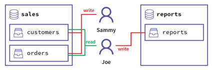
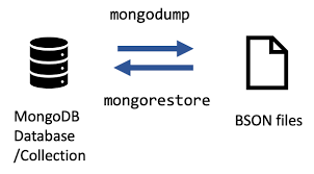
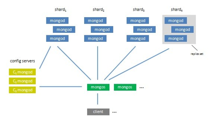

|               |                                 |                                        |
| ------------- | ------------------------------- | -------------------------------------- |
| **Modul 165** | **NoSQL-Datenbanken einsetzen** |  |

- [1. User Management](#1-user-management)
  - [1.1. Einleitung](#11-einleitung)
  - [1.2. Befehlsübersicht zur Benutzerverwaltung](#12-befehlsübersicht-zur-benutzerverwaltung)
  - [1.3. Rollen und Berechtigungen](#13-rollen-und-berechtigungen)
  - [1.4. Localhost Exception](#14-localhost-exception)
  - [1.5. Authentication Database](#15-authentication-database)
  - [1.6. Login](#16-login)
- [2. MongoDB Utilities](#2-mongodb-utilities)
  - [2.1. Dump und Restore](#21-dump-und-restore)
    - [2.1.1. mongodump](#211-mongodump)
    - [2.1.2. mongorestore](#212-mongorestore)
    - [2.1.3. mongoimport](#213-mongoimport)
    - [2.1.4. mongoexport](#214-mongoexport)
- [3. Replica Sets](#3-replica-sets)
  - [3.1. Was ist ein Replica Sets](#31-was-ist-ein-replica-sets)
  - [3.2. Replikationsprozess](#32-replikationsprozess)
  - [3.3. Initialisierung eines Replica Sets](#33-initialisierung-eines-replica-sets)
  - [3.4. Wichtige Szenarien](#34-wichtige-szenarien)
  - [3.5. Weiterführende Quellen](#35-weiterführende-quellen)

---

</br>

# 1. User Management

## 1.1. Einleitung

**MongoDB** bietet integrierte Mechanismen für die Verwaltung von **Benutzern** und deren **Berechtigungen**. Benutzer werden auf Datenbankebene definiert und **authentifiziert**. Mit dem User Management können Administratoren den Zugriff auf Datenbanken und deren Ressourcen sicher und kontrolliert verwalten.

Das **User Management** in MongoDB ist flexibel und leistungsfähig. Mit **Rollen** und **Berechtigungen** lässt sich der Zugriff präzise steuern, was Sicherheit und Kontrolle gewährleistet. Eine gut geplante Benutzer- und Rollenverwaltung ist essenziell für den **sicheren Betrieb** einer MongoDB-Datenbank.



## 1.2. Befehlsübersicht zur Benutzerverwaltung

```javascript
// Benutzer mit Schreib- und Leserechten erstellen
use admin
db.createUser({
  user: "leser_schreiber",
  pwd: "password123",
  roles: [
    { role: "readWrite", db: "testdb" }
  ]
})

// Alle Benutzer einer Datenbank anzeigen
use testdb
db.getUsers()

// Alle Benutzer im System anzeigen
use admin
db.system.users.find().pretty()

// Benutzer entfernen
use admin
db.dropUser("leser_schreiber")

// Passwort eines Benutzers ändern
use admin
db.updateUser("leser_schreiber", { pwd: "neuesPasswort456" })

// Rollen eines Benutzers ändern
use admin
db.updateUser("leser_schreiber", {
  roles: [
    { role: "read", db: "testdb" }
  ]
})
```

## 1.3. Rollen und Berechtigungen

| **Rolle**        | **Beschreibung**                          |
| :--------------- | :---------------------------------------- |
| **read**         | Leserechte auf der angegebenen Datenbank. |
| **readWrite**    | Lese- und Schreibrechte.                  |
| **dbAdmin**      | Verwaltungsrechte (Indexe, Statistiken).  |
| **userAdmin**    | Benutzer und Rollen verwalten.            |
| **clusterAdmin** | Cluster-Verwaltungsrechte.                |

- **userAdminAnyDatabase**: Admin Berechtigung auf allen Datenbanken
- **readWrite**: Lese- und Schreibzugriff auf nicht System Collection’s.

Beispiel: Benutzer mit Administratorrechten erstellen

```javascript
use admin
db.createUser({
  user: "admin",
  pwd: "secureAdmin123",
  roles: [
    { role: "userAdminAnyDatabase", db: "admin" },
    { role: "readWriteAnyDatabase", db: "admin" }
  ]
})
```

Beispiel: Benutzer mit spezifischen Berechtigungen erstellen

```javascript
use shop
db.createUser({
  user: "kundenEditor",
  pwd: "safePassword123",
  roles: [
    {
      role: "readWrite",
      db: "shop",
      collection: "kunden"
    }
  ]
})
```

## 1.4. Localhost Exception

- Auf einer MongoDB-Instanz gilt die Localhost-Exception nur, wenn noch keine Benutzer oder Rollen in der MongoDB-Instanz erstellt worden sind.
- Dient ausschliesslich für den Initialzugang um den ersten Datenbankbenutzer anzulegen. Danach ist der Zugang deaktiviert.
- Der Initial-Benutzer benötigt die Berechtigungen um weitere Benutzer anlegen zu können.
- Erforderliche Benutzerrollen: userAdmin, userAdminAnyDatabase

## 1.5. Authentication Database

- Wenn Sie einen Benutzer hinzufügen, legen Sie ihn in einer bestimmten **Authentication Datenbank** an.
- Die Privilegien eines Benutzers sind jedoch nicht auf seine Authentication Datenbank beschränkt.
- Benutzer werden immer in einer Datenbank angelegt, können aber Berechtigung zu anderen Datenbank erhalten.
- Der Name eines Benutzers und die Authentication Datenbank dienen als eindeutiger Identifikator für diesen Benutzer.

## 1.6. Login

- Initial Benutzer erstellen
  - `use admin db.createUser({user: "admin", pwd: "admin", roles: ["userAdminAnyDatabase", "readWriteAnyDatabase"]})`
- Anmeldung
  - `mongosh --port 27017 -u admin -p admin --authenticationDatabase admin`

MongoDB ohne Authentifizierung starten:

- `mongod --auth`

Login mit Authentifizierung

- `mongo -u "superAdmin" -p "superSecure123" --authenticationDatabase "admin"`

Beispiele

```javascript
// Datenbank Login
use admin 
db.auth("admin", "admin")

// Datenbankbenutzer wechseln
db.logout()
use app
db.auth("app", "app")

// Benutzer aktualisieren
db.updateUser("app", {roles: ["read"]})
```

---

# 2. MongoDB Utilities

## 2.1. Dump und Restore

Das **Sichern** und **Wiederherstellen** in MongoDB ist ein wichtiger Bestandteil beim Umgang mit einer Datenbank.
MongoDB stellt für die Sicherstellung und Wiederherstellung zwei Dienstprogramme zur Verfügung:

- **mongodump**
- **mongorestore**



### 2.1.1. mongodump

Das B**ackup-Dienstprogramm** mongodump können verschiedene Sicherstellung ausgeführt werden:

- einen Server (komplett)
- eine Datenbank
- eine Collection
- nur einen Teil einer Collection

Syntax: `mongodump --host <database-host> -d <database-name> --port <database-port> --out directory`

### 2.1.2. mongorestore

Das **Wiederherstellungsdienstprogramm** mongorestore stellt eine von mongodump erstellte binäre Sicherung wieder her.

Syntax: `mongorestore --host [host name] --port 3017 --username [user] --password [password] [backup folder]`
Beispiel: `mongorestore -h <host>:<port> -u <username> -p <password> -d <DBNAME> /path/to/destination/directory/<DBNAME>`

### 2.1.3. mongoimport

- MongoDB stellt für den Datenimport das Dienstprogramm mongoimport zur Verfügung
- Ist ein Befehlszeilentool, das einen JSON- oder CSV-Export, die in einer MongoDB-Instanz einspielt.
- Wichtige Option: **--jsonArray**

Beispiele:

```console
mongoimport --db myinfo --collection userdetails --file newuserdetails.json
mongoimport --db myinfo --collection userdetails --type csv --headerline --file /backup_data/backup/userdetails.csv
mongoimport –-help
```

### 2.1.4. mongoexport

- MongoDB stellt für den Datenexport das Dienstprogramm mongoexport zur Verfügung
- Ist ein Befehlszeilentool, das einen JSON- oder CSV-Export von Daten erstellt, die in einer MongoDB-Instanz gespeichert sind.

Beispiele:

```console
mongoexport --collection=books --db=bookdb --out=books.json
mongoexport --uri="mongodb://mongodb0.mongodbtutorial.org:27017/bookdb“ --collection=books --out=books.json
mongoexport –-help
```

---

# 3. Replica Sets

Die Replikation in MongoDB ermöglicht es, Daten über mehrere Server zu verteilen, um **Hochverfügbarkeit**, **Datenredundanz** und **Lastverteilung** sicherzustellen. Dies wird hauptsächlich durch die Verwendung von **Replica Sets** erreicht.

Durch die Kombination von **Primary**, **Secondaries** und optionalen **Arbitrern** lässt sich die Datenbank optimal an die Anforderungen moderner Anwendungen anpassen.

- Die **Ausfallsicherheit** durch sogenannte Replica Sets sichergestellt.
- MongoDB unterstützt mittels **Sharding** die horizontale Skalierung (Partitionierung der Daten).
- Die Daten über mehrere Server hinweg, den sogenannten **Shards** partitioniert.
- 

## 3.1. Was ist ein Replica Sets

Ein Replica Set ist eine** Gruppe von MongoDB-Instanzen**, die die gleichen Daten enthalten. Es besteht aus folgenden Komponenten:

- **Primary**
  - Nimmt alle Schreib- und Leseanfragen entgegen (standardmäßig für Schreiboperationen).
  - Repliziert die Datenänderungen an die Secondaries.
  - Es gibt nur einen Primary in einem Replica Set zu einem bestimmten Zeitpunkt.
- **Secondary**
  - Speichert Kopien der Daten des Primaries.
  - Kann als Failover-Option dienen, falls der Primary ausfällt.
  - Optional für Leseoperationen konfigurierbar (readPreference).
- **Arbiter**
  - Nimmt nicht an der Datenspeicherung teil.
  - Dient nur dazu, bei Wahlen die Mehrheit zu gewährleisten (wichtig bei ungerader Anzahl von Mitgliedern).

## 3.2. Replikationsprozess

Änderungen am **Primary** werden in ein Oplog (Operations Log) geschrieben.
Secondaries **replizieren** diese Änderungen asynchron, indem sie das Oplog des Primaries lesen und die Änderungen anwenden.

## 3.3. Initialisierung eines Replica Sets

```javascript
rs.initiate({
  _id: "meinReplicaSet",
  members: [
    { _id: 0, host: "primary.mongodb.net:27017" },
    { _id: 1, host: "secondary1.mongodb.net:27017" },
    { _id: 2, host: "secondary2.mongodb.net:27017" }
  ]
})
```

## 3.4. Wichtige Szenarien

- **Failover**
  - Wenn der Primary ausfällt, führen die Secondaries eine Wahl durch, um einen neuen Primary zu bestimmen.
  - Beispiel:
    - Primary: Server A
    - Secondary: Server B, Server C
    - Fällt Server A aus, wird einer der Secondaries zum neuen Primary.
- **Geografische Replikation**
  - Ein Replica Set kann so konfiguriert werden, dass Daten über mehrere Regionen repliziert werden, um eine höhere Ausfallsicherheit und niedrigere Latenz für regionale Nutzer zu gewährleisten.

## 3.5. Weiterführende Quellen

- [Database Scaling](<https://www.mongodb.com/basics/scaling>)
- [Replication and Sharding](<https://www.geeksforgeeks.org/mongodb-replication-and-sharding/>)
