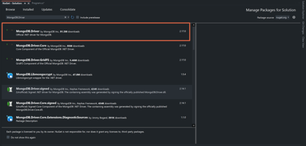

|               |                                 |                                        |
| ------------- | ------------------------------- | -------------------------------------- |
| **Modul 165** | **NoSQL-Datenbanken einsetzen** |  |

- [1. .NET Driver](#1-net-driver)
  - [1.1. Einleitung](#11-einleitung)
  - [1.2. Installation](#12-installation)
  - [1.3. Grundlegende Komponenten](#13-grundlegende-komponenten)
  - [1.4. CRUD Operationen](#14-crud-operationen)
- [2. Aufgaben](#2-aufgaben)
  - [2.1. Aufgabe .NET Driver](#21-aufgabe-net-driver)

---

</br>

# 1. .NET Driver

## 1.1. Einleitung

Der MongoDB **.NET Driver** ist eine Bibliothek, die es ermöglicht, MongoDB-Datenbanken in .NET-Anwendungen (C#, VB.NET, etc.) zu verwenden. Er stellt eine flexible und leistungsfähige API bereit, um Datenbankoperationen wie CRUD (Create, Read, Update, Delete) auszuführen sowie erweiterte Features wie Aggregationen und Transaktionen zu nutzen.

[Start Developing with MongoDB](https://www.mongodb.com/docs/drivers/)

## 1.2. Installation

Die Installation des .NET Drivers erfolgt über NuGet. Dazu wird das folgende Paket installiert:
`Install-Package MongoDB.Driver`



## 1.3. Grundlegende Komponenten

- `MongoClient`
  - Verbindet die Anwendung mit der MongoDB-Instanz.
  - `var client = new MongoClient("mongodb://localhost:27017");`
- `IMongoDatabase`
  - Repräsentiert eine Datenbank in MongoDB.
  - `var database = client.GetDatabase("meineDatenbank");`
- `IMongoCollection<T>`
  - Repräsentiert eine Sammlung (Collection) innerhalb der Datenbank.
  - `var collection = database.GetCollection<BsonDocument>("meineSammlung");`

[MongoDB with C#](https://www.mongodb.com/docs/languages/csharp/)
[MongoDB Driver Quick Tour](https://mongodb.github.io/mongo-csharp-driver/2.18/getting_started/quick_tour/)
[Quick Start: C# and MongoDB](https://www.mongodb.com/blog/post/quick-start-c-sharp-and-mongodb-starting-and-setup)

## 1.4. CRUD Operationen

```c#
// Einfügen von Dokumenten

// Einzeldokument
var dokument = new BsonDocument { { "name", "Max Mustermann" }, { "alter", 30 } };
collection.InsertOne(dokument);

// Mehrere Dokumente:
var dokumente = new List<BsonDocument>
{
    new BsonDocument { { "name", "Anna" }, { "alter", 25 } },
    new BsonDocument { { "name", "Peter" }, { "alter", 28 } }
};
collection.InsertMany(dokumente);


// Abfragen (Read)

// Alle Dokumente abfragen:
var dokumente = collection.Find(new BsonDocument()).ToList();
foreach (var doc in dokumente)
{
    Console.WriteLine(doc);
}

// Filterabfrage
var filter = Builders<BsonDocument>.Filter.Eq("name", "Max Mustermann");
var ergebnis = collection.Find(filter).FirstOrDefault();
Console.WriteLine(ergebnis);


// Aktualisieren

// Ein Dokument aktualisieren
var filter = Builders<BsonDocument>.Filter.Eq("name", "Max Mustermann");
var update = Builders<BsonDocument>.Update.Set("alter", 31);
collection.UpdateOne(filter, update);

// Mehrere Dokumente aktualisieren:
var filter = Builders<BsonDocument>.Filter.Gt("alter", 25);
var update = Builders<BsonDocument>.Update.Set("status", "aktualisiert");
collection.UpdateMany(filter, update);


// Löschen

// Ein Dokument löschen:
var filter = Builders<BsonDocument>.Filter.Eq("name", "Anna");
collection.DeleteOne(filter);

Mehrere Dokumente löschen:
var filter = Builders<BsonDocument>.Filter.Lt("alter", 30);
collection.DeleteMany(filter);
```

---

# 2. Aufgaben

## 2.1. Aufgabe .NET Driver

| **Vorgabe**             | **Beschreibung**                                                      |
| :---------------------- | :-------------------------------------------------------------------- |
| **Lernziele**           | Können einen Datenbanktreiber installieren                            |
|                         | Können CRUD Operationen in der gewählten Programmiersprache ausführen |
| **Sozialform**          | Einzelarbeit                                                          |
| **Auftrag**             | siehe unten                                                           |
| **Hilfsmittel**         | [Start with Guides](https://www.mongodb.com/docs/guides/)             |
| **Erwartete Resultate** |                                                                       |
| **Zeitbedarf**          | 90 min                                                                |
| **Lösungselmente**      | Vollständige Skriptdatei mit sämtlichen Lösungsdateien                |
|                         | Kurzpräsentation der Lösung                                           |

Lerne wie Datenbankbefehle (CRUD) in Deiner bevorzugten Sprache mit dem zugehörigen MongoDB-Treiber ausführt werden können.

**Aufgabe 1 - [Tutorial](https://www.mongodb.com/docs/guides/)**

Arbeite das Chapter 2 - CRUD des "Start with Guides" Tutorials komplett durch.
Wählen Sie dabei die Programmiersprache "C#", sodass die Codebeispiele in dieser Sprache angezeigt werden.

**Aufgabe 2 - Praxis:**

Schreibe ein kleines C#-Programm, welches auf eine von Dir selbst erstellte Datenbank (z.B. Lernangebot) zugreift und mehrere CRUD-Befehle ausführt.
Dokumentiere im Programmcode die Datenbankbefehle ausführlich (XML-Kommentare) als Befehlsreferenz.
