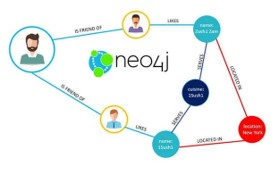
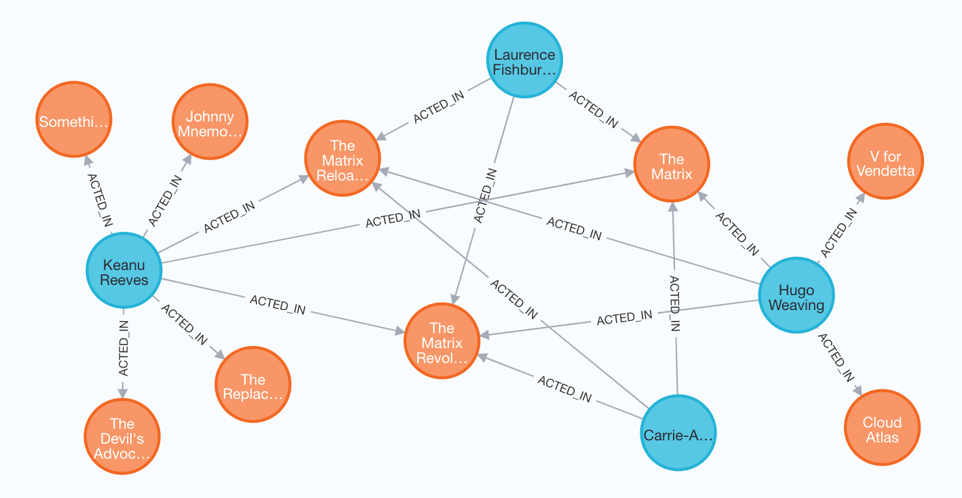
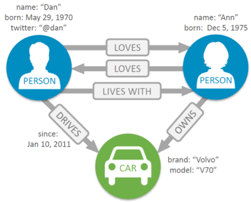
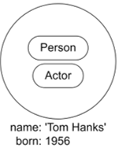
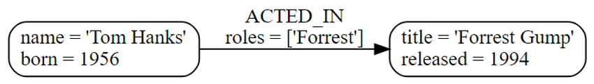
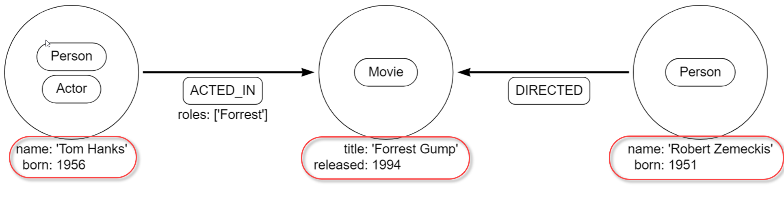
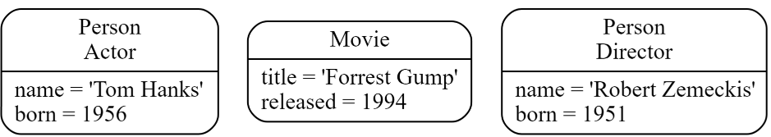
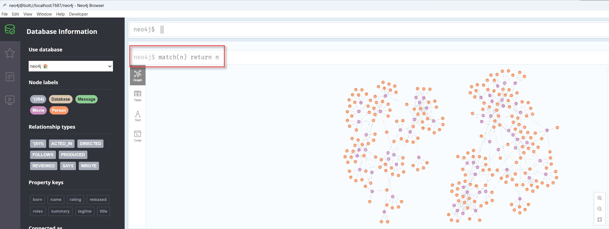

|               |                                 |                                        |
| ------------- | ------------------------------- | -------------------------------------- |
| **Modul 165** | **NoSQL-Datenbanken einsetzen** |  |

- [1. Neo4j Graph Database](#1-neo4j-graph-database)
  - [1.1. Was ist Neo4j?](#11-was-ist-neo4j)
    - [1.1.1. Merkmale](#111-merkmale)
  - [1.2. Neo4j-Nutzung in ausgewählten Branchen](#12-neo4j-nutzung-in-ausgewählten-branchen)
  - [1.3. Neo4j-Nutzung der Kunden](#13-neo4j-nutzung-der-kunden)
  - [1.4. Hauptelemente von Neo4j](#14-hauptelemente-von-neo4j)
    - [1.4.1. Knoten (Nodes)](#141-knoten-nodes)
    - [1.4.2. Beziehungen (Relationships)](#142-beziehungen-relationships)
    - [1.4.3. Eigenschaften (Properties)](#143-eigenschaften-properties)
    - [1.4.4. Labels](#144-labels)
    - [1.4.5. Abfragen (Cypher)](#145-abfragen-cypher)
- [2. Aufgaben](#2-aufgaben)
  - [2.1. Movie Tutorial](#21-movie-tutorial)

---

</br>

# 1. Neo4j Graph Database

## 1.1. Was ist Neo4j?

**Neo4j** ist eine führende **Graphdatenbank**, die speziell dafür entwickelt wurde, **Beziehungen** zwischen Daten effizient zu speichern und abzurufen. Sie basiert auf einem **graphenorientierten** Modell, bei dem Daten als **Knoten (Nodes)**, **Beziehungen (Edges)** und **Eigenschaften (Properties)** dargestellt werden.

**Neo4j** wird in Bereichen wie Social Media, Finanzdienstleistungen, Logistik, IT-Netzwerken und Wissensmanagement eingesetzt, um komplexe Datenstrukturen intuitiv und effizient zu analysieren.
Hauptvorteile sind die **einfache Modellierung** von Daten, **schnelle Abfragen** und ein **starkes Ökosystem** mit zahlreichen Integrationen und Community-Support.



[Neo4j in 100 Seconds](https://www.youtube.com/watch?v=T6L9EoBy8Zk)

Konzept

- Die Architektur ist auf eine optimale Verwaltung, Speicherung und Durchquerung von Knoten und Beziehungen ausgelegt.
- Die Graph-Datenbank verfolgt einen property-graph-approach, der sowohl für die Traversal-Leistung als auch für die Laufzeit der Operationen von Vorteil ist.
- Eine Graph-Datenstruktur besteht aus **Knoten** (diskreten Objekten), die durch **Beziehungen** verbunden werden können.

### 1.1.1. Merkmale

- **Leistungsstark bei Beziehungsdaten**
  - Optimiert für die Analyse und Abfrage komplexer Beziehungen.
- **Cypher Query Language**
  - Eine deklarative, SQL-ähnliche Sprache für Abfragen von Graphen.
- **Skalierbarkeit**
  - Unterstützt grosse Datenmengen und verteilte Cluster-Umgebungen.
- **Echtzeit-Abfragen**
  - Ideal für Anwendungen wie Empfehlungsmaschinen, Betrugserkennung und Netzwerküberwachung.



## 1.2. Neo4j-Nutzung in ausgewählten Branchen


## 1.3. Neo4j-Nutzung der Kunden


## 1.4. Hauptelemente von Neo4j

Die Hauptelemente bilden die Grundlage von Neo4j und ermöglichen es, **komplexe Datennetze** intuitiv zu modellieren und zu analysieren.
Eine Graph-Datenstruktur besteht aus **Knoten (Nodes)**, die durch **Beziehungen (Relationships)** verbunden werden können.

**Das Neo4j-Eigenschaftsgraphen-Datenbankmodell besteht aus:**

- **Knoten** beschreiben Entitäten eines Bereichs und können keine oder mehr Labels zur Klassifizierung haben.
- **Beziehungen** beschreiben eine Verbindung zwischen einem Quell- und einem Ziel-Knoten und haben immer eine Richtung.
- Knoten und Beziehungen können **Eigenschaften (Schlüssel-Wert-Paare)** festgelegt werden.



### 1.4.1. Knoten (Nodes)

- **Knoten** sind die Hauptelemente eines Graphen und repräsentieren **Entitäten oder Objekte**.
- Jeder Knoten kann eine oder mehrere **Labels** haben, um seine Kategorie zu kennzeichnen.
- Zusätzlich können **Knoten** **Eigenschaften** enthalten, die **Informationen über die Entität** speichern.



- **Labels**
  - Person, Actor
- **Properties**
  - name, born

```javascript
CREATE (:Person {name: 'Alice', age: 30, city: 'Berlin'})
```

### 1.4.2. Beziehungen (Relationships)

- **Beziehungen** verbinden zwei Knoten und haben einen Typ (Relationship Type), der ihre Bedeutung beschreibt.
- Eine Beziehung hat immer nur einen **Beziehungstyp**.
- Sie können ebenfalls **Eigenschaften** enthalten. Beziehungen sind gerichtet, z. B. "WOHNHAFT_IN" oder "KAUFT".



- Die `ACTED_IN` **Beziehung** mit dem Tom Hanks als Quell- und Forrest Gump als Zielknoten.
- Bei **Knoten** `"Tom Hanks"` ist es eine ausgehende, bei `"Forrest Gump"` eine eingehende Beziehung.
- **Properties**: roles: ['Forrest'], performance:5
- roles ist ein array[]
- `CREATE ()-[:ACTED_IN {roles: ['Forrest'], performance: 5}]->()`

```javascript
MATCH (p:Person {name: 'Alice'}), (c:City {name: 'Berlin'})
CREATE (p)-[:WOHNHAFT_IN]->(c)
```

### 1.4.3. Eigenschaften (Properties)

- **Eigenschaften** sind **Schlüssel-Wert-Paare**, die zusätzliche Informationen über Knoten oder Beziehungen speichern.
- **Eigenschaften** besitzen einen Datentyp wie z.B. String, Boolean etc.
- **Eigenschaften** können auch in Datenfelder (Arrays) gespeichert werden.



```javascript
CREATE (:City {name: 'Berlin', population: 3600000})
```

### 1.4.4. Labels

- **Labels** kategorisieren Knoten und ermöglichen eine effiziente Abfrage von Daten.
- Ein Knoten kann mehrere **Labels** haben.



```javascript
CREATE (:Person:Employee {name: 'Bob', position: 'Manager'})
```

### 1.4.5. Abfragen (Cypher)

- **Cypher** ist die Abfragesprache von Neo4j.
- Sie ermöglicht es, Knoten, Beziehungen und deren Eigenschaften zu erstellen, zu lesen, zu aktualisieren und zu löschen.

```javascript
CREATE (TheMatrix:Movie {title:'The Matrix', released:1999, tagline:'Welcome to the Real World'})
CREATE (Keanu:Person {name:'Keanu Reeves', born:1964})
CREATE (Carrie:Person {name:'Carrie-Anne Moss', born:1967})
CREATE (Laurence:Person {name:'Laurence Fishburne', born:1961})
CREATE (Hugo:Person {name:'Hugo Weaving', born:1960})

MATCH (p:Person {name: 'Alice'}) RETURN p
```

---

# 2. Aufgaben

## 2.1. Movie Tutorial

| **Vorgabe**             | **Beschreibung**                               |
| :---------------------- | :--------------------------------------------- |
| **Lernziele**           | Sie können die Neo4j Desktop Anwendung starten |
|                         | Sie können einen Abfragebefehl ausführen       |
|                         | Sie können das Abfrageresultat untersuchen     |
| **Sozialform**          | Einzelarbeit                                   |
| **Auftrag**             | siehe unten                                    |
| **Hilfsmittel**         | Internet                                       |
| **Erwartete Resultate** |                                                |
| **Zeitbedarf**          | 40 min                                         |
| **Lösungselmente**      | Funktionierende Neo4j Desktop Anwendung        |

**Aufgabe 1:**

- Starte die **Neo4j Desktop** Anwendung und öffne im Neo4j Browser die Example **Movie Datenbank** (Movie DBMS)
- Führe den Befehl aus: `neoj4$> match(n) return n`
- Untersuche das Abfrageresultat (Knoten u. Beziehugnen)



**Aufgabe 2:**

- Starte den Befehl `:guide intro`
- Arbeite das Tutorial (Total 8 Punkte) ab.

- Starte den Befehl `:guide concepts`
- Arbeite das Tutorial (Total 7 Punkte) ab.

- Starte den Befehl: `$ :play movie-graph`
- Arbeite das Tutorial (Total 10 Punkte) ab.
