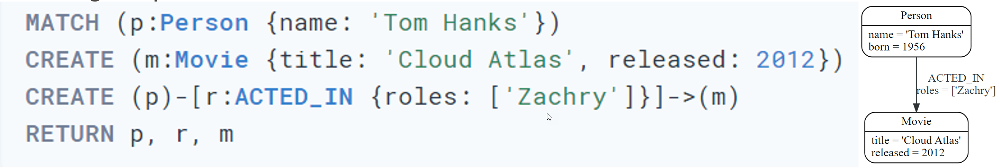
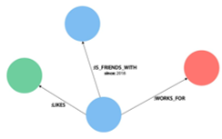
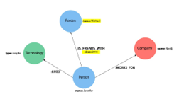
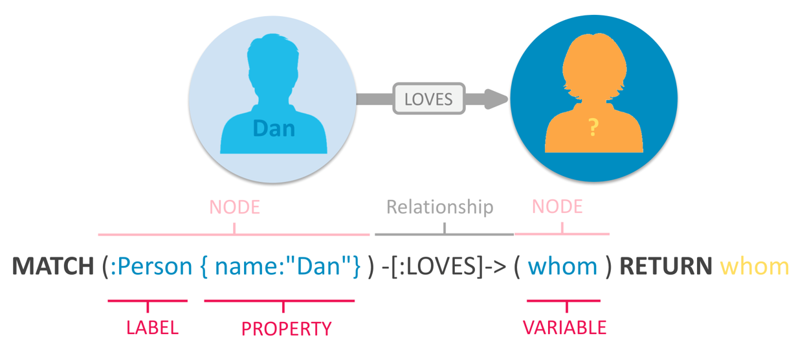
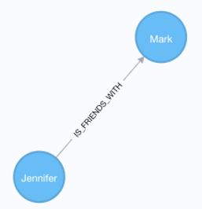
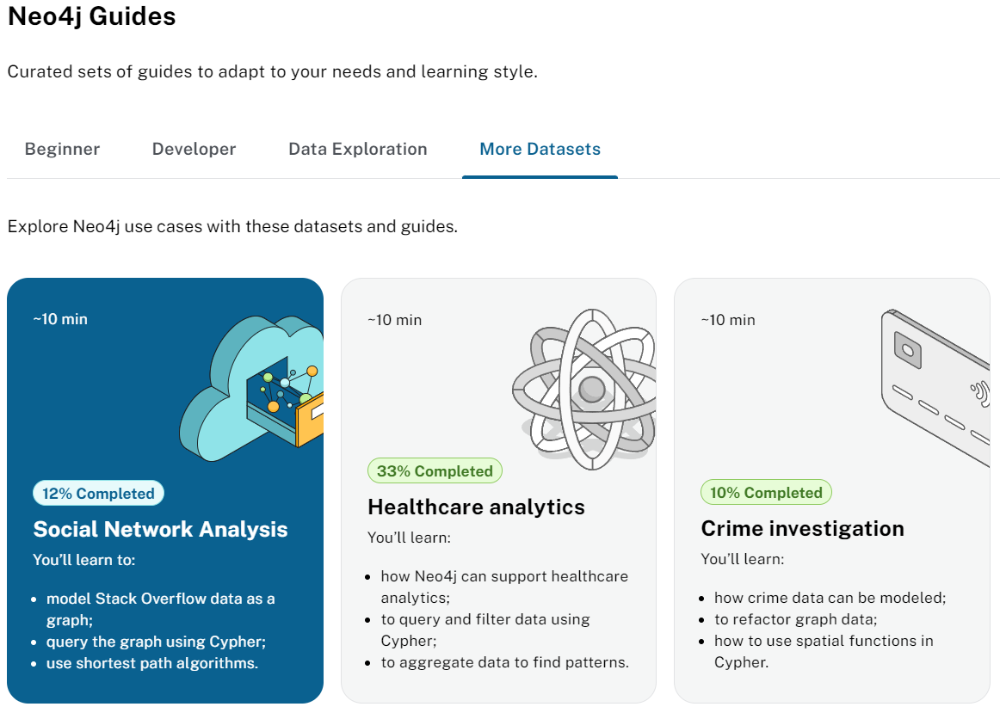

|               |                                 |                                        |
| ------------- | ------------------------------- | -------------------------------------- |
| **Modul 165** | **NoSQL-Datenbanken einsetzen** |  |

- [1. Neo4j Cypher](#1-neo4j-cypher)
  - [1.1. Cypher – Beziehungen darstellen](#11-cypher--beziehungen-darstellen)
  - [1.2. Muster](#12-muster)
  - [1.3. MATCH](#13-match)
  - [1.4. RETURN](#14-return)
  - [1.5. Alias Return Values](#15-alias-return-values)
  - [1.6. CREATE](#16-create)
  - [1.7. UPDATE](#17-update)
  - [1.8. DELETE](#18-delete)
  - [1.9. REMOVE](#19-remove)
  - [1.10. MERGE](#110-merge)
- [2. Aufgaben](#2-aufgaben)
  - [2.1. Gruppenarbeit Neo4j Cypher](#21-gruppenarbeit-neo4j-cypher)
  - [2.2. Aura Fully Managed Graph Database](#22-aura-fully-managed-graph-database)

---

</br>

# 1. Neo4j Cypher

- **Cypher** ist die deklarative **Abfragesprache** von Neo4j, einer führenden Graphdatenbank.
- Mit **Cypher** können Benutzer effizient Daten aus Graphdatenbanken abfragen, einfügen, aktualisieren und löschen.
- Die Sprache verwendet eine lesbare, **ASCII-artige Syntax**, um **Knoten** (Nodes), **Beziehungen** (Relationships) und **Eigenschaften** zu modellieren.
- Die Syntax bietet eine visuelle und logische Möglichkeit, Muster von Knoten und Beziehungen im Graphen abzugleichen
Cypher wurde so konzipiert, dass es für jedermann leicht zu erlernen, zu verstehen und zu verwenden ist, aber auch die Leistungsfähigkeit und Funktionalität anderer Standard-Datenzugriffssprachen bietet.



## 1.1. Cypher – Beziehungen darstellen

- **Beziehungen** werden in Cypher durch einen **Pfeil** -> dargestellt
- Den Beziehungstyp und die Eigenschaften von Beziehungen werden mit eckigen Klammern angegeben **[]**
- Beispiel: **LIKES**, **IS_FRIEND_WITH** u. **WORKS_FOR**

```javascript
// Daten werden mit dieser Richtung gespeichert
CREATE (p:Person)-[:LIKES]->(t:Technology)

// Abfrage in umgekehrter Reihenfolge liefert keine Ergebnisse
MATCH (p:Person)<-[:LIKES]-(t:Technology)

// Falls die Richtung nicht bekannt ist, 
// mit ungerichteter Beziehung abfragen
MATCH (p:Person)-[:LIKES]-(t:Technology)
```



- **Eigenschaften** sind **Name-Werte Paare** um Knoten oder Beziehungen zu beschreiben.
- **Eigenschaften** werden in **geschweiften Klammern** definiert.
- Beispiel Knoten (name) und Beziehungseigenschaft (since)
- Knoteneigenschaft: (p:Person {name: 'Jennifer'})
- Beziehungseigenschaft: -[rel:IS_FRIENDS_WITH {since: 2018}]->


## 1.2. Muster

- Mit **Cypher** können einfache und sehr komplexe Muster formuliert werden.
- In Mustern können Knoten und Beziehungen beliebig kombiniert werden.

Beispiel:

```javascript
(p:Person {name: "Jennifer"})-[rel:LIKES]->(g:Technology {type: "Graphs"})
```



## 1.3. MATCH

Mit dem Schlüsselwort `MATCH` wird in **Cypher** nach einem vorhandenen **Knoten**, einer **Beziehung**, einem **Label**, einer Eigenschaft oder einem Muster in der Datenbank gesucht.



```javascript
MATCH (p:Person {name: "Tom Hanks"})-[:DIRECTED]->(m:Movie) 
RETURN m.title, m.released

// Mach all nodes
MATCH(n)
RETURN n;

// Match all nodes with a Person label
MATCH (n:Person)
RETURN n;

// Match all nodes with a Person label and property name is "Tom Hanks"
// Note: Only works with exaxt matches
MATCH(n:Person {name: "Tom Hanks"})
RETURN n;

// Return nodes with label Person and name property equals "Tom Hanks"
MATCH(p:Person)
WHERE p.name = "Tom Hanks"
RETURN p;

// Return nodes with label Movie, released property is between 1991 and 1999
MATCH(m:Movie)
WHERE m.released > 1990 AND m.released < 2000
RETURN m;
```

## 1.4. RETURN

- Zurückgeben von Werte oder Ergebnisse einer Cypher-Abfrage
- Bei Schreibvorgängen nicht erforderlich

```javascript
MATCH (tom:Person {name: 'Tom Hanks'})
RETURN tom

MATCH (:Person {name: 'Tom Hanks'})-[:DIRECTED]->(movie:Movie)
RETURN movie.title
```

## 1.5. Alias Return Values

Rückgabewerte können mit aussagkräftigen Benennungen versehen werden.

```javascript
//cleaner printed results with aliasing
MATCH (tom:Person {name:'Tom Hanks'})-[rel:DIRECTED]-(movie:Movie)
RETURN tom.name AS name, tom.born AS `Year Born`, movie.title AS title, movie.released AS `Year Released`
```

## 1.6. CREATE

- Mit der CREATE Anweisung können Knoten, Beziehungen und Muster in die Datenbank eingefügt werden.
- Falls das Ergebnis nicht angezeigt werden soll, kann die RETURN-Klausel weggelassen werden.


```javascript
// Mit Ergebnis
CREATE (friend:Person {name: 'Mark'})
RETURN friend

// Ohne Ergebnis
CREATE (friend:Person {name: 'Mark'})

//Create a person node called "Tom Hanks"
CREATE (p:Person {name:"Tom Hanks"});

//Create an ACTED_IN relationship between "Tom Hanks" and "Apollo 13"
MATCH (p:Person {name:"Tom Hanks"}), (m:Movie {title:"Apollo 13"})
CREATE (p)-[:ACTED_IN]->(m);

//Create the pattern of "Tom Hanks" ACTED_IN "Apollo 13"
//This will create the entire pattern, nodes and all!
CREATE (:Person {name:"Tom Hanks")-[:ACTED_IN]->(:Movie {title:"Apollo 13});
```

- Beziehung zwischen existierenden Knoten hinzufügen.
- Mit der MATCH Anweisung müssen die beteiligten Knoten zuerst gesucht werden um doppelte Knoten auszuschliessen



```javascript
MATCH (jennifer:Person {name: 'Jennifer'})
MATCH (mark:Person {name: 'Mark'})
CREATE (jennifer)-[rel:IS_FRIENDS_WITH]->(mark)
```

> Mit der **CREATE** Anweisung werden immer neue Knoten eingefügt.
> Mit den **MERGE** Befehl können doppelte Einträge verhindert werden(create oder select).

## 1.7. UPDATE

- Mit der UPDATE-Anweisung können Eigenschaften von Knoten oder Beziehungen hinzugefügt, entfernt oder aktualisiert werden.
- Der zu aktualisierende Knoten muss mit MATCH gesucht werden
- Mit Schlüsselwort SET kann der Eigenschaft (variable.property) einen Wert zugewiesen werden.

```javascript
MATCH (p:Person {name: 'Jennifer'})
SET p.birthdate = date('1980-01-01')
RETURN p
```

Eigenschaften von Beziehungen (WORKS_FOR) aktualisieren.

```javascript
MATCH (:Person {name: 'Jennifer'})-[rel:WORKS_FOR]-(:Company {name: 'Neo4j'})
SET rel.startYear = date({year: 2018})
RETURN rel
```

## 1.8. DELETE

- Mit der DELETE-Anweisung können Daten, d.h. Knoten und Beziehungen gelöscht werden.
- Knoten, welche in Beziehungen stehen, können nicht gelöscht werden (ACID). Dies würde zu unvollständigen Graphen führen.

```javascript
MATCH (m:Person {name: 'Mark'})
DELETE m
```

Um Beziehungen zu löschen, müssen zuerst der Start- und Endknoten gesucht werden.
Löschen der Beziehung mit **DELETE** variablename (der Beziehung)

```javascript
MATCH (j:Person {name: 'Jennifer'})-[r:IS_FRIENDS_WITH]->(m:Person {name: 'Mark'})
DELETE r
```

Um Knoten zusammen mit **allen existierenden Beziehungen** zu löschen, kann der **DETACH DELETE** Befehl verwendet werden.
Dabei wird der Knoten zuerst gesucht und dann zusammen mit den Beziehungen gelöscht.

```javascript
MATCH (m:Person {name: 'Mark'})
DETACH DELETE m
```

## 1.9. REMOVE

- Mit REMOVE können Eigenschaften von Knoten oder Beziehungen gelöscht werden.
- Eigenschaften lasse sich auch mit der Zuweisung von null (SET property=null) löschen, da Null-Werte in Neo4j nicht verwaltet werden.

```javascript
//delete property using REMOVE keyword
MATCH (n:Person {name: 'Jennifer'})
REMOVE n.birthdate

//delete property with SET to null value
MATCH (n:Person {name: 'Jennifer'})
SET n.birthdate = null
```

## 1.10. MERGE

- Mit der MERGE-Anweisung können redundante Daten vermieden werden.
- MERGE führt eine "select or insert" Operation aus.
- Nicht existierende Knoten werden automatisch neu angelegt.

```javascript
MERGE (mark:Person {name: 'Mark'})
RETURN mark
```

Mit der MERGE-Anweisung können analog den Knoten auch Beziehungen zwischen existierenden Knoten angelegt oder gesucht werden.

```javascript
MATCH (j:Person {name: 'Jennifer'})
MATCH (m:Person {name: 'Mark'})
MERGE (j)-[r:IS_FRIENDS_WITH]->(m)
RETURN j, r, m
```

Mit der MERGE-Anweisung kann auch ein gesamtes Muster mit Knoten und Beziehungen einfach hinzugefügt werden.
Mit MERGE werden immer komplette Muster als Ganzes erstellt oder abgeglichen (entweder oder). Partielles Abgleichen oder Erzeugen eines Graphen ist nicht möglich (kein Mischbetrieb).

```javascript
//this statement will create duplicate nodes for Mark and Jennifer
MERGE (j:Person {name: 'Jennifer'})-[r:IS_FRIENDS_WITH]->(m:Person {name: 'Mark'})
RETURN j, r, m
```

Mit der **ON CREATE** Klausel können Eigenschaften beim anlegen von neuen Knoten initialisiert werden.
Mit der **ON MATCH** Klausel können Eigenschaften der bestehenden Knoten aktualisiert werden.

```javascript
MERGE (m:Person {name: 'Mark'})-[r:IS_FRIENDS_WITH]-(j:Person {name:'Jennifer'})
  ON CREATE SET r.since = date('2018-03-01')
  ON MATCH SET r.updated = date()
RETURN m, r, j
```

# 2. Aufgaben

## 2.1. Gruppenarbeit Neo4j Cypher

| **Vorgabe**             | **Beschreibung**                                                                                |
| :---------------------- | :---------------------------------------------------------------------------------------------- |
| **Lernziele**           | Die Studierenden gewinnen eine Übersicht zu den Basiselementen der Neo4j Cypher Query Sprache   |
|                         | Sie können die Grundelemente anhand von konkreten Beispielen selbständig erläutern und anwenden |
| **Sozialform**          | Gruppenarbeit                                                                                   |
| **Auftrag**             | siehe unten                                                                                     |
| **Hilfsmittel**         | [Cypher](https://neo4j.com/developer/cypher/)                                                   |
|                         | [Cypher Clauses](https://neo4j.com/docs/cypher-manual/current/clauses/)                         |
|                         | `$ :play cypher`                                                                                |
| **Erwartete Resultate** |                                                                                                 |
| **Zeitbedarf**          | 60 min                                                                                          |
| **Lösungselmente**      | Präsentation                                                                                    |
|                         | Cypher Skriptdatei (Code Beispiele)                                                             |

- Recherchieren Sie alle wichtigen Informationen über das Ihnen zugeteilte Themengebiet und fassen sie diese mittels konkreten Code Beispielen zusammen.
- Stellen Sie Ihre Ergebnisse mittels einer Kurzpräsentation der Klasse vor.
- Verwenden Sie dabei die Hilfsmittel wie Flow-Charts, Beamer, Wandtafel usw. und verweisen Sie ggf. auf weitere die Literatur.
- Die Zusammenfassungen und Beispiel sind dann den anderen Klassenkameraden zur Verfügung zu stellen.

**Gruppe 1 – Syntax, Naming rules (<https://neo4j.com/docs/cypher-manual/current/syntax/>)**

- Comments
- Naming rules for Nodes, Node Variables, Node Labels
- Data types
- Key words
- Syntax
- ASCII-Art

**Gruppe 2 – Nodes / Relationships (<https://neo4j.com/docs/cypher-manual/current/clauses/create/>)**

- Nodes, Node Variables, Node Labels
- CREATE
- Property types
- Null value
- Relationship Variables
- CREATE relationship (Patterns)
- Relationship Properties

**Gruppe 3 – Query (<https://neo4j.com/docs/cypher-manual/current/clauses/>)**

- MATCH
- WHERE
- RETURN
- ALIAS
- MERGE
  - ON CREATE
  - ON MATCH
- UPDATE
- DELETE

---

## 2.2. Aura Fully Managed Graph Database

| **Vorgabe**             | **Beschreibung**                                                            |
| :---------------------- | :-------------------------------------------------------------------------- |
| **Lernziele**           | Sie können den Zugang zur Neo4j Aura Cloud Datenbank einrichten             |
|                         | Sie können eine Datenbank-Instanz anlegen                                   |
|                         | Sie können Tutorial Datensets installieren                                  |
|                         | Sie sind in der Lage die Datenauswertungen des Tutorials erklären zu können |
| **Sozialform**          | Gruppenarbeit                                                               |
| **Auftrag**             | siehe unten                                                                 |
| **Hilfsmittel**         | [AuraDB](https://neo4j.com/product/auradb/)                                 |
|                         | [Cypher Clauses](https://neo4j.com/docs/cypher-manual/current/clauses/)     |
|                         | `$ :play cypher`                                                            |
| **Erwartete Resultate** |                                                                             |
| **Zeitbedarf**          | 60 min                                                                      |
| **Lösungselmente**      | Präsentation                                                                |

**Neo4j Guides:**

- Mit Neo4j Aura startet der Anbieter seinen ersten verwalteten **Graphdatenbank-as-a-Service**, der sich vor allem an kleine und mittelgrosse Unternehmen richtet.
- Neo4j Aura soll diesen Unternehmungen sowie deren Entwicklern die Erstellung von einfachen und flexibler sowie komplexen Datenbankanwendungen ermöglichen – beispielsweise in Bereichen wie **Machine Learning**, **Betrugserkennung** oder bei der **Kundenbetreuung**.

**Aufgabe:**

- Richten Sie sich einen [Zugang zur Aura Datenbank](https://neo4j.com/product/auradb/) mit einer neuen Instanz ein.
- Nach der Registrierung wählen Sie in oben rechts "**Access all Neo4j Guides**"


**Arbeiten Sie eines der nachfolgend aufgeführten Tutorials durch (siehe More Datasets):**

- Social Network Analysis
- Healthcare Analytics
- Crime Investigation



- Erstellen Sie zur Datenstruktur und den relevanten Cypher-Befehle bzw. Datenauswertungen des Tutorials eine kurze Zusammenfassung.
- Präsentieren Sie danach Ihre Kurzfassung der Klasse
