|               |                                 |                                        |
| ------------- | ------------------------------- | -------------------------------------- |
| **Modul 165** | **NoSQL-Datenbanken einsetzen** |  |

- [1. Neo4j Modeling](#1-neo4j-modeling)
  - [1.1. Schritte zur Datenmodellierung](#11-schritte-zur-datenmodellierung)
  - [1.2. Beispiel Filmempfehlungssystem](#12-beispiel-filmempfehlungssystem)
    - [1.2.1. Schritt 1: Domäne definieren](#121-schritt-1-domäne-definieren)
    - [1.2.2. Schritt 2: Modell erstellen](#122-schritt-2-modell-erstellen)
    - [1.2.3. Cypher Code](#123-cypher-code)
  - [1.3. Die arrows.app Anwendung](#13-die-arrowsapp-anwendung)
- [2. Schema](#2-schema)
  - [2.1. Constraints (Einschränkungen)](#21-constraints-einschränkungen)
  - [2.2. Indexe](#22-indexe)
    - [2.2.1. Property Index](#221-property-index)
    - [2.2.2. Composite Index](#222-composite-index)
    - [2.2.3. Text Index](#223-text-index)
    - [2.2.4. Relationship Index](#224-relationship-index)
  - [2.3. Zusammenfassung](#23-zusammenfassung)
- [3. Schema-Management](#3-schema-management)
- [4. Aufgaben](#4-aufgaben)
  - [4.1. Technology Datenbank modellieren und implementieren](#41-technology-datenbank-modellieren-und-implementieren)
  - [4.2. Lernangebot Datenbank modellieren und implementieren](#42-lernangebot-datenbank-modellieren-und-implementieren)

---

</br>

# 1. Neo4j Modeling

- Die Datenmodellierung in **Neo4j** folgt einem graphzentrierten Ansatz, bei dem die Realität in Form von **Knoten** (Nodes), **Beziehungen** (Relationships), **Labels** und Eigenschaften dargestellt wird.
- Dies ermöglicht eine natürliche Repräsentation von vernetzten Daten wie sozialen Netzwerken, Lieferketten oder Wissensgrafen.
- 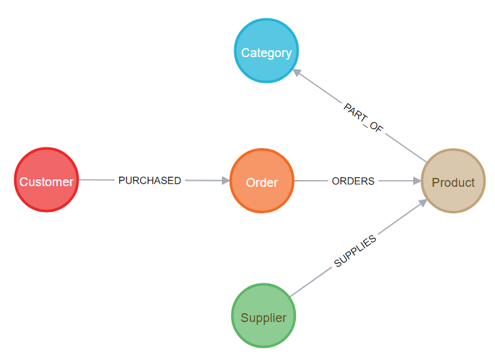

## 1.1. Schritte zur Datenmodellierung

**Definieren der Domäne:**

Zunächst analysierst du die Problemstellung und identifizierst:

- **Entitäten**: Diese werden als Knoten dargestellt.
  - Beispiel: Personen, Filme, Produkte.
- **Beziehungen**: Diese verbinden die Knoten und beschreiben deren Verbindungen.
  - Beispiel: Eine Person "kennt" eine andere, ein Benutzer "kauft" ein Produkt.
- **Eigenschaften**: Attribute der Knoten und Beziehungen.
  - Beispiel: Eine Person hat einen Namen und ein Alter, eine Beziehung hat ein Datum.

**Erstellen des Graphmodells:**

Das Modell wird mit Knoten, Labels, Beziehungen und Eigenschaften gezeichnet. 
Dabei gilt:

- Knoten repräsentieren Entitäten.
- Beziehungen sind gerichtete oder ungerichtete Verbindungen zwischen Knoten.
- Labels kategorisieren Knoten in Typen.
- Eigenschaften speichern Details als Schlüssel-Wert-Paare

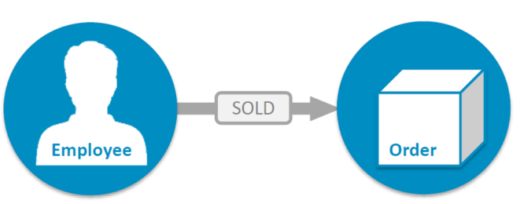

Fremdschlüssel werden zu Beziehungen mit korrekter Richtung

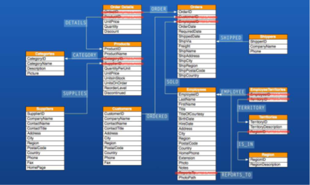

Join-Tabellen (n:n) werden zu Beziehungen, Attribute zu Eigenschaften

| **Mit Beziehungstabellen**                                         | **Ohne Beziehungstabellen**                                 |
| ------------------------------------------------------------------ | ----------------------------------------------------------- |
| 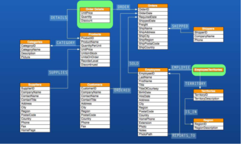 | 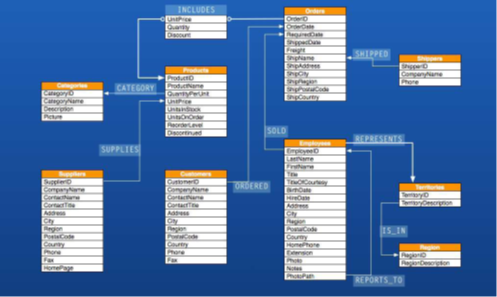 |

Lösung

| **Tabellen**                                         | **Graph**                                               |
| ---------------------------------------------------- | ------------------------------------------------------- |
| 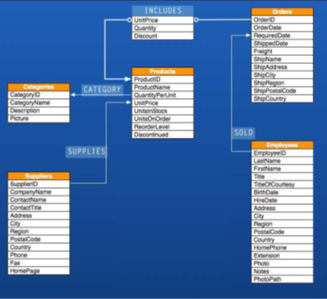 | 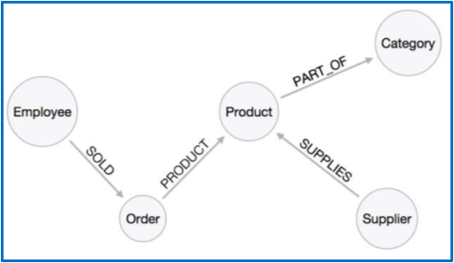 |

---

## 1.2. Beispiel Filmempfehlungssystem

### 1.2.1. Schritt 1: Domäne definieren

- Knoten:
  - Benutzer (`User`)
  - Filme (`Movie`)
- Beziehungen:
  - Benutzer "sieht" einen Film (`WATCHED`).
  - Benutzer "bewertet" einen Film (`RATED`).
- Eigenschaften:
  - Benutzer: `name`, `age`
  - Filme: `title`, `genre`, `releaseYear`
- Beziehungen: `RATED` hat eine Eigenschaft `rating` (z. B. 5 Sterne).

### 1.2.2. Schritt 2: Modell erstellen

- In der arrows.app sieht das Modell so aus:
  - Ein Knoten `User` mit den Eigenschaften `name` und `age`.
  - Ein Knoten `Movie` mit den Eigenschaften `title`, `genre`, `releaseYear`.
  - Eine gerichtete Beziehung `WATCHED` von User zu `Movie`.
  - Eine gerichtete Beziehung `RATED` von `User` zu `Movie` mit der Eigenschaft `rating`.

### 1.2.3. Cypher Code

```javascript
// Einfügen von Knoten
CREATE (u:User {name: 'Alice', age: 25})
CREATE (m:Movie {title: 'Inception', genre: 'Sci-Fi', releaseYear: 2010})

// Beziehungen hinzufügen
MATCH (u:User {name: 'Alice'}), (m:Movie {title: 'Inception'})
CREATE (u)-[:WATCHED]->(m)
CREATE (u)-[:RATED {rating: 5}]->(m)

// Abfragen

// Filme, die Alice gesehen hat
MATCH (u:User {name: 'Alice'})-[:WATCHED]->(m:Movie)
RETURN m.title

// Bewertungen von Alice
MATCH (u:User {name: 'Alice'})-[r:RATED]->(m:Movie)
RETURN m.title, r.rating
```

---

## 1.3. Die arrows.app Anwendung

- Die **arrows.app** ist eine kostenlose, webbasierte Anwendung zur Visualisierung und Planung von Graphdatenmodellen.
- Sie ermöglicht es, Knoten (Nodes), Beziehungen (Relationships), Labels und Eigenschaften in einem intuitiven Drag-and-Drop-Editor zu zeichnen.
- Mit der Anwendung können **Graphstrukturen** schnell erstellt, bearbeitet und als **Bild** oder **Cypher-Abfragen** exportiert werden, um sie direkt in Neo4j oder andere Graphdatenbanken zu implementieren.

- Die **arrows.app** eignet sich ideal für Entwickler, Datenarchitekten und Graphdatenbank-Enthusiasten, die mit minimalem Aufwand professionelle Diagramme erstellen möchten.

- Öffne die [arrows.app](https://arrows.app/) und arbeite das Tutorial durch.

- 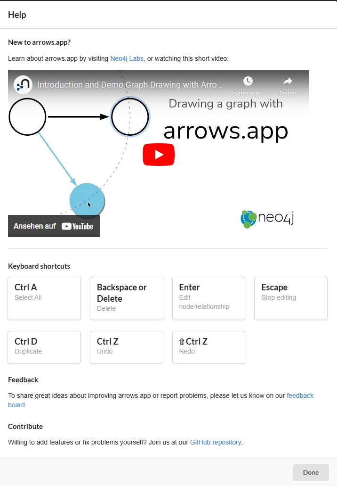
- 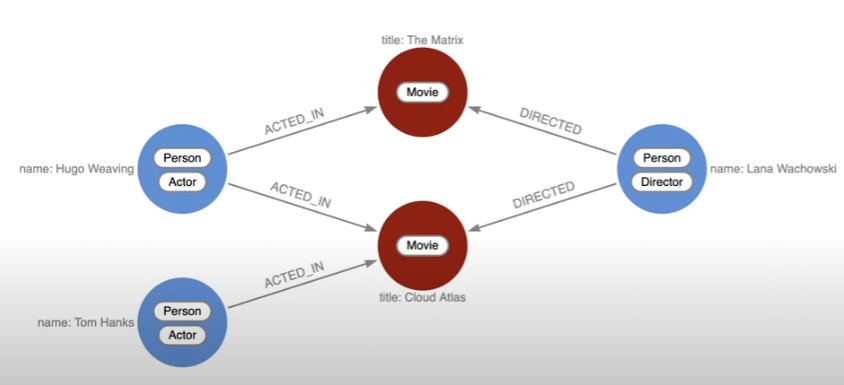

---

# 2. Schema

Neo4j unterstützt Schema-Operationen wie **Constraints** und **Indexe**, um die Datenintegrität sicherzustellen und die Performance von Abfragen zu optimieren. Diese Werkzeuge sind besonders wichtig, um **effiziente Datenzugriffe** zu ermöglichen und sicherzustellen, dass Daten den **definierten Regeln** entsprechen.

## 2.1. Constraints (Einschränkungen)

Constraints erzwingen Regeln in der Datenbank, die die Datenqualität sicherstellen. Neo4j bietet mehrere Typen von Constraints.

**UNIQUE Constraint:**

- Stellt sicher, dass ein bestimmtes Eigenschaftswert-Set in Knoten eindeutig ist.
- z.B. erzwingt, dass der Wert der Eigenschaft name für Knoten mit dem Label Person eindeutig ist.

```javascript
CREATE CONSTRAINT uniquePersonName 
FOR (p:Person) REQUIRE p.name IS UNIQUE
```

**NOT NULL Constraint:**

- Stellt sicher, dass eine Eigenschaft auf einem Knoten immer einen Wert hat.
- z.B. erzwingt, dass die Eigenschaft age in allen Person-Knoten gesetzt ist.

```javascript
CREATE CONSTRAINT notNullPersonAge
FOR (p:Person) REQUIRE p.age IS NOT NULL
```

**NODE KEY Constraint:**

- Kombiniert mehrere Eigenschaften, um die Eindeutigkeit eines Knotens zu garantieren.
- z.B. stellt sicher, dass die Kombination aus name und email für alle Person-Knoten eindeutig ist.
  
```javascript
CREATE CONSTRAINT personNodeKey
FOR (p:Person) REQUIRE (p.name, p.email) IS NODE KEY
```

## 2.2. Indexe

Indexe beschleunigen Abfragen, indem sie die Suche nach Knoten und Beziehungen basierend auf bestimmten Eigenschaften optimieren. Neo4j bietet verschiedene Arten von Indexen.
Ein Index auf eine oder mehrere Eigenschaften eines Knotens oder einer Beziehung.

### 2.2.1. Property Index

Ein Index auf eine oder mehrere Eigenschaften eines Knotens oder einer Beziehung.

```javascript
CREATE INDEX personNameIndex 
FOR (p:Person) ON (p.name)
```

Erstellt einen Index auf die Eigenschaft name für Knoten mit dem Label Person.

### 2.2.2. Composite Index

Ein Index auf die Kombination mehrerer Eigenschaften.

```javascript
CREATE INDEX personCompositeIndex 
FOR (p:Person) ON (p.name, p.email)
```

Optimiert Abfragen, die sowohl name als auch email betreffen.

### 2.2.3. Text Index

Optimiert die Suche nach Textwerten, z. B. für Full-Text-Suchen.

```javascript
CREATE TEXT INDEX personDescriptionIndex 
FOR (p:Person) ON (p.description)
```

Optimiert Text-basierte Suchabfragen.

### 2.2.4. Relationship Index

Ein Index für Eigenschaften von Beziehungen.

```javascript
CREATE INDEX knowsSinceIndex 
FOR ()-[r:KNOWS]-() ON (r.since)
```

Erstellt einen Index auf die Eigenschaft since der Beziehung KNOWS.

## 2.3. Zusammenfassung

| **Funktion**   | **Ziel**                                   | **Beispiel**                        |
| :------------- | :----------------------------------------- | :---------------------------------- |
| **UNIQUE**     | Sicherstellen, dass Werte einzigartig sind | `CREATE CONSTRAINT ... IS UNIQUE`   |
| **NOT NULL**   | Sicherstellen, dass Werte existieren       | `CREATE CONSTRAINT ... IS NOT NULL` |
| **Index**      | Beschleunigung von Abfragen                | `CREATE INDEX ...                   |
| **TEXT INDEX** | Full-Text-Suchen optimieren                | `CREATE TEXT INDEX ...`             |

Mit **Constraints** wird die **Datenqualität** sichergestellt, während **Indexe** die **Performance** verbessern. Beide sind essenziell für eine effiziente und zuverlässige Nutzung von Neo4j.

---

# 3. Schema-Management

```javascript
// Zeigt eine Liste aller Constraints in der Datenbank.
SHOW CONSTRAINTS

// Zeigt alle bestehenden Indexe mit Status und Typ.
SHOW INDEXES

// Löschen von Constraints
DROP CONSTRAINT uniquePersonName

// Löschen von Indexen
DROP INDEX personNameIndex
```

</br>

# 4. Aufgaben

## 4.1. Technology Datenbank modellieren und implementieren

| **Vorgabe**             | **Beschreibung**                                                                                                       |
| :---------------------- | :--------------------------------------------------------------------------------------------------------------------- |
| **Lernziele**           | Kennt die Bedienung der arraws.app Anwendung                                                                           |
|                         | Die Studierenden sind in der Lage ein relationales Datenbank Modell in eine Neo4j Graph-Datenbank umzusetzen           |
|                         | Sie können ein relationales Datenbankmodell in ein Graph-Modell überführen                                             |
|                         | Sie kennen die Grundelemente wie Node und Relationship von Graph-Datenbanken und können diese in Cypher implementieren |
| **Sozialform**          | Einzelarbeit                                                                                                           |
| **Auftrag**             | siehe unten                                                                                                            |
| **Hilfsmittel**         | [arrows.app](https://arrows.app/)                                                                                      |
| **Erwartete Resultate** |                                                                                                                        |
| **Zeitbedarf**          | 60 min                                                                                                                 |
| **Lösungselmente**      | Grafische Datenmodell als Bild                                                                                         |
|                         | Vollständige Cypher Skript Datei                                                                                       |

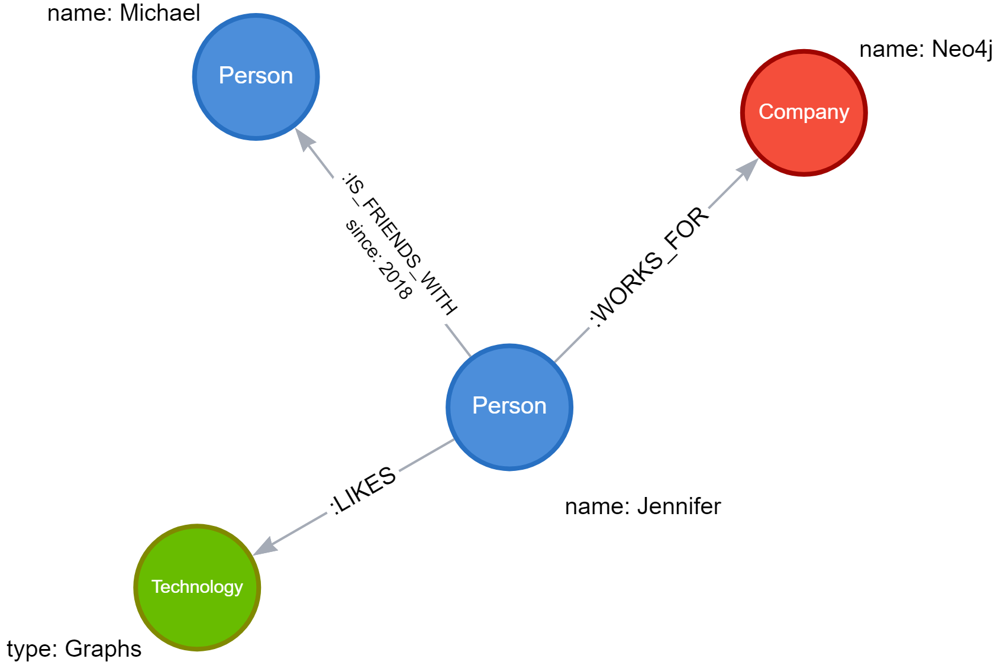

1. Modellieren Sie mit [arrows.app](https://arrows.app/)  das obige Graph Modell
2. Erstellen Sie in Neoj4 eine neue Datenbank z.B. Technology
3. Schreiben Sie die Cypher Befehle und die Knoten aus den obigen Modell einzufügen (CREATE, MERGE)
4. Fügen Sie die Beziehungen zwischen den Knoten hinzu (MATCH, CREATE)
5. Prüfen Sie die eingefügten Daten mit einige Auswertungen (MATCH)

---

## 4.2. Lernangebot Datenbank modellieren und implementieren

| **Vorgabe**             | **Beschreibung**                                                                                                       |
| :---------------------- | :--------------------------------------------------------------------------------------------------------------------- |
| **Lernziele**           | Die Studierenden sind in der Lage ein relationales Datenbank Modell in eine Neo4j Graph-Datenbank umzusetzen           |
|                         | Sie können ein relationales Datenbankmodell in ein Graph-Modell überführen                                             |
|                         | Sie kennen die Grundelemente wie Node und Relationship von Graph-Datenbanken und können diese in Cypher implementieren |
| **Sozialform**          | Einzelarbeit                                                                                                           |
| **Auftrag**             | siehe unten                                                                                                            |
| **Hilfsmittel**         | [arrows.app](https://arrows.app/), [neo4j docs](https://neo4j.com/docs/)                                               |
| **Erwartete Resultate** |                                                                                                                        |
| **Zeitbedarf**          | 60 min                                                                                                                 |
| **Lösungselmente**      | Grafische Datenmodell als Bild                                                                                         |
|                         | Vollständige Cypher Skript Dateien                                                                                     |

**Ausgangssituation:**
Das relationale Schema der Lernangebot Beispieldatenbank soll vollständig in eine Graph-Datenbank (Neo4j) überführt werden.

**Relationales Datenbank Modell:**

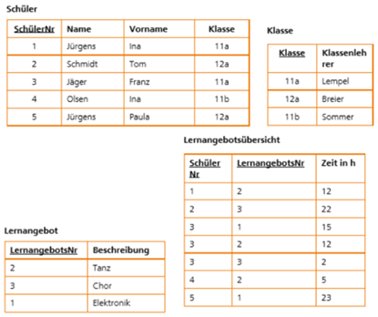

**Aufgabe 1 - Graph Modell entwickeln:**

- Überführen Sie das relationale Datenbank Modell in ein Graph-Modell.
- Gehen Sie dabei wie folgt vor:
  - Streichen Sie in allen Tabellen die Fremdschlüssel-Attribute weg und bezeichnen Sie die Beziehungen (Verbindungslinien) mit einem Namen (Relationship). z.B lives_in.
  - Rufen Sie die Web-Applikation <https://arrows.app> auf und informieren Sie sich über die Möglichkeiten zur Entwicklung von Graph-Modellen im Tutorial Video.
  - Entwerfen in arrows.app das Graph-Modell.
  - Beachten Sie dabei folgende Namenskonventionen:
    - Tabellen: Nodes, Benennung = Substantiv
    - Beziehungen: Relationship, Benennung = Verb
- Lösungselement: `la_graph_model.png`

**Aufgabe 2 - Datenmodell implementieren:**

- Schreiben Sie alle Cypher-Befehle, um das Graph-Modell in der Neo4j Datenbank vollständig mit den Knoten und Beziehungen zu implementieren und speichern Sie die Befehle in einer Cypher Skriptdatei ab. Stellen Sie dabei sicher, dass die Knoten auch korrekt verknüpft werden.
- Lösungselement: `la_graph_data.cypher`

**Aufgabe 3 - Daten abfragen:**

- Schreiben Sie für die nachfolgenden Auswertungen den korrekten Cypher Abfrage Befehl. Verwenden Sie hierzu den MATCH() Befehl.
  - Listen Sie alle erfassten Schüler komplett mit sämtlichen Eigenschaften.
  - Listen Sie alle erfassten Schüler komplett mit Klassenlehrer.
  - Listen Sie die Schüler einer Klasse z.B. "11a".
  - Listen Sie alle Schüler die den Kurs z.B. "Tanz" besuchen.
  - Listen Sie die Anzahl Schüler aller Klassen.
  - Der Schüler "Tom Schmidt" wurde falsch eingetragen, ändern Sie seinen Namen auf Thomas.
  - Der Schüler "Franz Jäger" ist ausgetreten, schreiben Sie die Löschbefehle.
- Lösungselement: `la_graph_query.cypher`

**Aufgabe 4 - Schema Befehl - Constraints:**

- Stellen Sie durch ein Constraint sicher, dass Lernangebot.Beschreibung unique ist, sodass keine doppelten Einträge mehr möglich sind.
- Lösungselement: `la_graph_constraints.cypher`

**Aufgabe 5 - Schema Befehl - Indices:**

- Erstellen Sie, um die Abfrage von Schülern über die Eigenschaft "Name" zu beschleunigen einen Index.
- Lösungselement: `la_graph_indices.cypher`
